# AWS에서 ec2 인스턴스를 만들어보자!

## 클라우드 서비스를 한마디로 말하면?  

 물리적 자원 혹은 논리적 자원을 대여하는 것을 말합니다. 때문에 사용자는 물리적인 장비 관리나 논리적인 자원 관리(로그 관리, 네트워크 관리, 로그 관리 등)에 큰 신경을 쓰지 않아도 됩니다. 또한 AWS는 RDS와 같은 관리형 데이터베이스를 제공해서 구축 비용을 절감시키고, 회사의 입장에서도 인건비나 유지비용을 줄일 수 있습니다.

---
## 계정 만들기  
 

1. 먼저 계정을 만들어봅시다. 계정을 만들 때 해외 결제가 되는 VISA 혹은 MASTER CARD가 필요합니다.       

    

 

2. 전화번호 인증도 필요합니다.

     
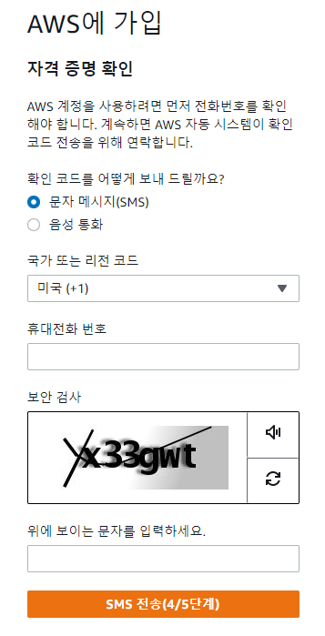

 

3. Support 플랜을 '기본지원-무료'하고 가입 완료를 클릭하면 가입이 완료됩니다.  

    

 

---
## EC2란?
Elastic Compute Cloud. 한마디로 물리적인 자원을 대여해 주는 것입니다. OS, CPU, 메모리, 디스크 자원의 크기를 선택하고 서버를 생성할 수 있습니다. 
### EC2에 자원 생성하기
1. 메인 페이지 우측 상단에 '콘솔에 로그인'을 클릭합니다
   
   
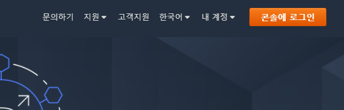

 

2. 콘솔의 우측 상단에 지역을 자신의 지역에 가까운 지역을 선택합니다. 나중에 터미널에서 인스턴스에 접근할 때 응답을 좀더 빠르게 받을 수 있습니다. 
   
     
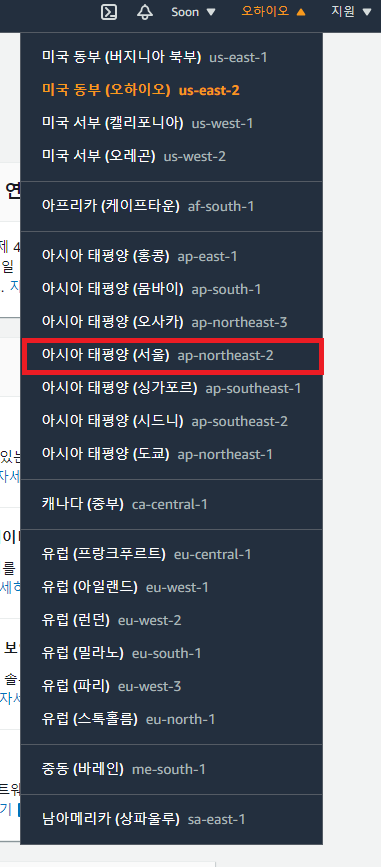

 

3. 화면 최상단에서 ec2를 검색하거나 솔루션 구축에서 가상 머신 시작을 클릭합니다. ec2를 검색해서 대시보드에 들어가게되면 왼쪽 사이드 바에 `인스턴스` 탭의 인스턴스 항목에 들어갑니다. 현재 생성한 인스턴스가 없기 때문에 새로 만들어주어야 합니다. 그러기 위해서는 오른쪽 상단의 `인스턴스 시작`을 클릭합니다.   

 

 

  
 

 

4. 운영체제, 애플리케이션 서버, 애플리케이션이 포함된 템플릿들이 나열됩니다. 여기서 맨 위에 프리 티어 사용 가능한 Amazon Linux 2 AMI (HVM), SSD Volume Type을 선택합니다. 
   

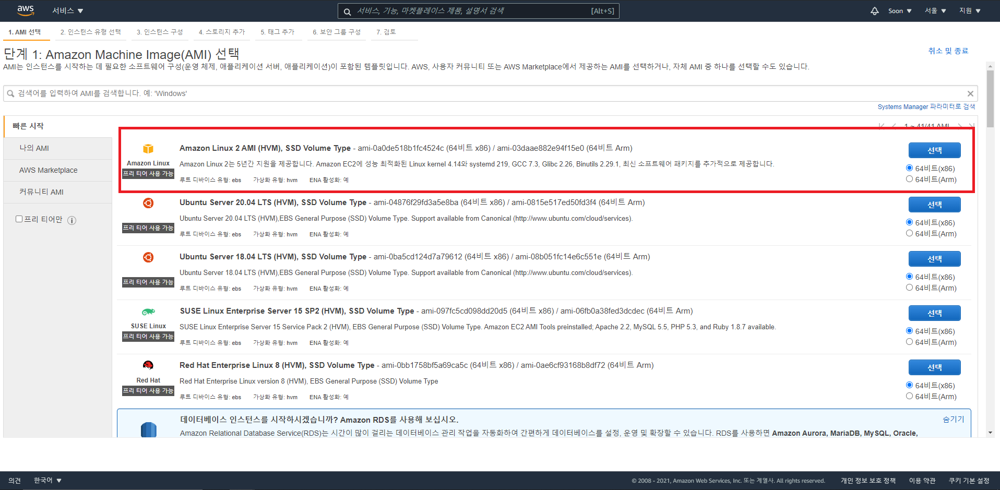

 

5. 인스턴스 유형 선택에서는 기본으로 체크되어 있는 t2.micro(프리 티어 사용 가능)을 선택하고 다음을 클릭합니다. 

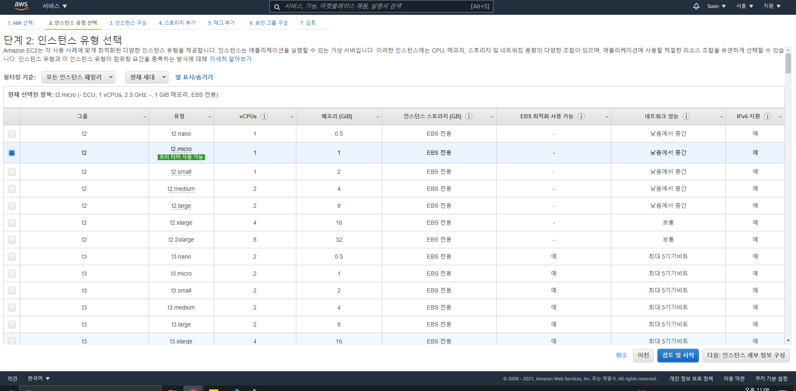

 

6. 인스턴스 세부 정보 구성은 기본값으로 두고 다음으로 넘어갑시다.

7. 스토리지 선택은 서버의 용량을 얼마나 쓸건지를 정하는 것입니다. 프리티어로 30GB까지 가능하다는 메시지가 있고 그 이상은 비용이 청구됩니다. 무료로 쓸 수 있는 최대치인 30GB를 사용합시다.

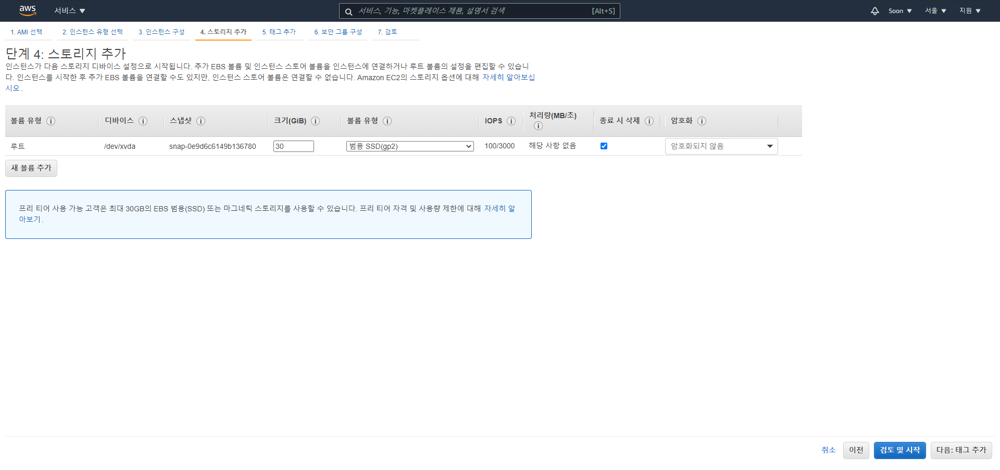

 

8. 태그는 인스턴스를 구별할 때 유용합니다. 생략해도 되나, 필요하다면 인스턴스를 구별할 수 있도록 적절한 키와 값을 태그로 지정해줍니다. 

9. 보안 그룹 구성은 방화벽 규칙을 생성하는 것입니다. 보안 그룹과 설명을 임의로 지정해주고, 지정된 IP에서만 ssh접속이 가능하도록 내 IP로 바꾸어줍니다. pem 키가 없으면 인스턴스에 접속되진 않지만 pem키를 분실할 경우를 대비하기 위해서입니다. 특정 포트를 추가하는 것도 가능하지만 우선 ssh 포트만 열어보겠습니다.   

   
 

10. 인스턴스 시작 검토에서 시작을 누르면 pem 키를 선택 혹은 생성하는 창이 뜹니다. 처음 키페어를 생성하므로 새 키 페어 생성으로 선택하고 키페어 이름을 지정한 후 다운로드합니다. 딱 한 번 다운로드 받을 수 있으며, pem 키가 유출되면 인스턴스에 접근 가능해지므로 자신이 잘 관리할 수 있는 디렉토리에 저장합시다. 

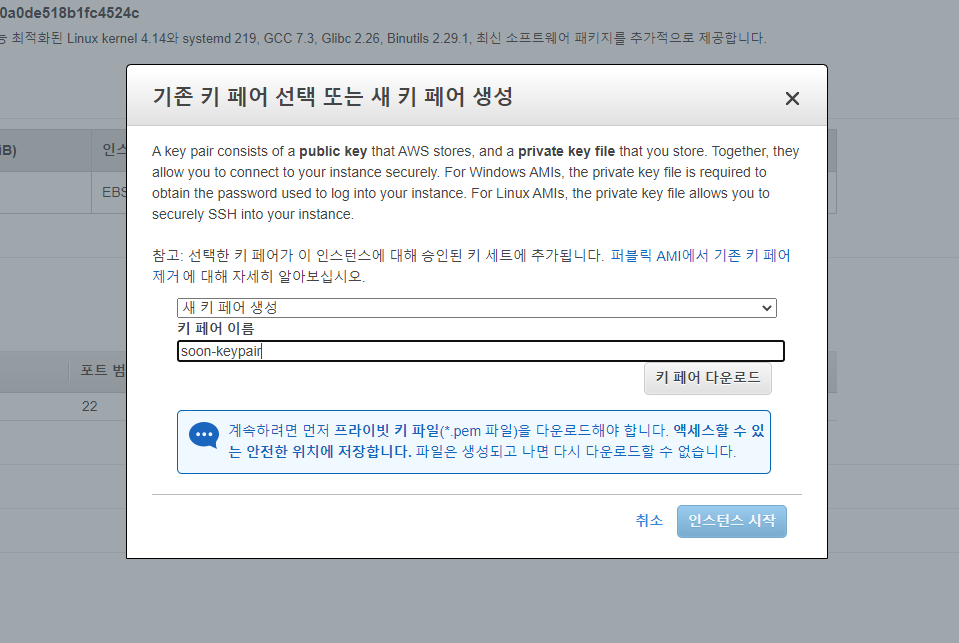
   
 

11. 시작 후 ec2 대시보드로 들어가면 인스턴스가 잘 생성되신 것을 확인할 수 있습니다. 

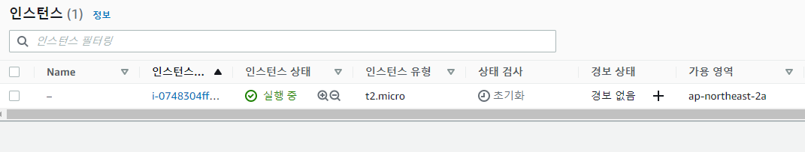
   
 

---

## EC2 서버 접속하기 (윈도우)
ssh에 쉽게 접속하기 위해서 putty 프로그램을 이용하겠습니다.   
다운로드 링크: https://www.chiark.greenend.org.uk/~sgtatham/putty/latest.html

* putty.exe 
* puttygen.exe (putty에서 pem키를 바로 사용할 수 없어서 ppk 파일로 변환해주는 프로그램)

1. puttygen을 실행시켜 pem키를 ppk 파일로 변환합니다. 상단의 `Conversion` 탭에서 `Import Key`를 선택해서 다운로드 받았던 pem 키를 불러옵니다.

    

   
 

2. 자동으로 전환된 것을 볼 수 있습니다. `Save pirvate key`를 클릭하고 경고메시지가 뜨면 예를 눌러서 넘어갑니다.
   
   

   
 

3. Amazon Linux의 username은 `ec2-user` 입니다.  
   > 인스턴스 사용자 계정 관리 관련내용: https://docs.aws.amazon.com/ko_kr/AWSEC2/latest/UserGuide/managing-users.html  

    Host Name 란에는 `ec2-user@public_ip`주소 형태로 적어줍니다. 여기서 public_ip는 인스턴스의 퍼블릭 IPv4주소를 말합니다. Connection type은 SSH로 설정합니다. 

    
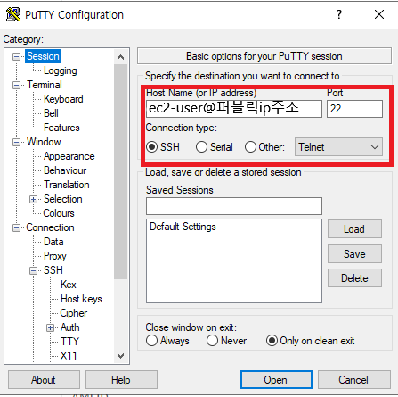
   
 

4. 사이드의 `Connetction → SSH → Auth`로 들어가서 `Browse...`를 클릭해 ppk 파일을 업로드해 줍니다. 
   
    
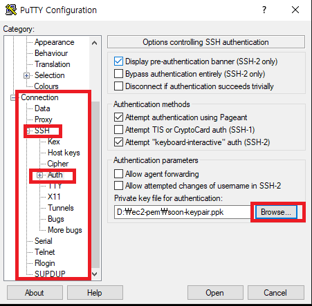
   
 

5. `Session`으로 다시 돌아와서 지금까지 설정ds한 정보를 저장합시다. 그리고나서 `open`을 클릭합니다. 서버의 호스트 키가 캐시가 없다고하는 경고창이 뜨는데 예를 눌러서 접속을 계속 진행합니다.   

    

   
 

6. SSH 접속이 성공한 화면입니다.    
   
    
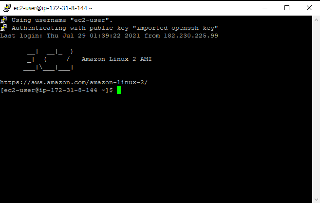
   
 
