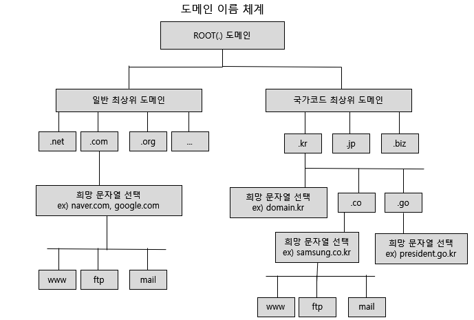
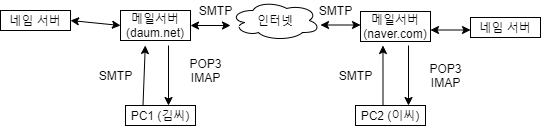

> 이 내용은 한빛미디어에서 출간한 <이것이 우분투 리눅스다> 내용을 토대로 제작 되었습니다.   
> 도서 자세히 알아보기: https://www.hanbit.co.kr/store/books/look.php?p_code=B3658372395    

*(대부분 책을 이용한 실습으로 진행. 복습시 책 참조)*

## 네임 서버의 개념
* 네임 서버 = DNS(Domain Name System) 서버
* 도메인 이름을 IP 주소로 변환시켜 주는 역할 
  * ex) www.naver.com ➡  125.209.222.142

## 네임서버 이름체계와 흐름도

## 메일 서버 
* 이메일 송수신에 사용되는 프로토콜 3가지
  * SMTP, POP3, IMAP

## 데이터베이스 서버 

## 웹서버
* APM = Apache 웹 서버 + 프로그래밍 언어 PHP + 데이터베이스 MariaDB(이전 MySQL)

## FTP 서버 
* 실습 중 리눅스 vsftpd 에러 - 500 OOPS : vsftpd: refusing to run with writable root inside chroot()   
  http://b.redinfo.co.kr/68 글을 통해 해결

## NFS 서버
* 리눅스 컴퓨터끼리 저장 공간을 공유하는 서비스 

## Samba 서버
* 윈도우즈와 리눅스/유닉스 사이에서 자원을 공유하기 위해서 개발됨

## DHCP 서버
* DHCP(Dynamic Host Configuration Protocol) 서버가 하는 역할은 자신의 네트워크 안에 있는 클라이언트 컴퓨터가 부팅될 때 자동으로 IP주소, 서브넷 마스크, 게이트웨이 주소, DNS 서버 주소를 할당해 주는 것임. 한정된 IP 주소를 가지고 더 많은 IP주소가 있는 것처럼 활용할 수 있음. 즉, 적은 개수의 IP주소로 여려 명의 사용자가 사용할 수 있다는 의미

## 프록시 서버 
* 프록시란 단어가 뜻하듯 대리인의 역할을 하는 서버
* 웹 환경에서 프록시 서버는 웹 클라이언트와 웹 서버 사이에서 요청한 데이터를 전달하는 역할
* 한 번 전송한 데이터를 캐시에 저장한 후, 같은 데이터를 또 요청할 경우에 캐시에 저장된 것을 보내줌 

## 방화벽
* 외부의 공개된 네트워크와 내부의 사설 네트워크 사이에 자리잡고, 외부와 내부에 전달되는 트래픽을 '정책(Policy)'에 의해서 허용/거부하는 역할을 하는 컴퓨터나 장치를 말함
* 내부의 사용자는 외부의 인터넷을 이용하면서, 외부에서는 내부로 침입할 수 없게 하는 방법 중 가장 보편적으로 많이 사용하는 방법이 사설IP(Private IP)라고 흔히 불리는 nonroutable IP주소를 이용함
* 사설 IP의 주소 범위는 
  * 10.0.0.0 ~ 10.255.255.255
  * 172.16.0.0 ~ 172.31.255.255
  * 192.168.0.0 ~ 192.168.255.255
* 사설 IP 주소의 컴퓨터가 외부의 인터넷으로 접속할 수 있도록 해 주는 방법을 IP 마스커레이딩(Masquerading)이라고 함
* SNAT: 내부에서 외부로 나가는 패킷의 출발지 IP 주소를 변경
* DNAT: 외부에서 내부로 들어오는 패킷에 있는 목적지 IP 주소를 변경하여 최종적으로 내부에 있는 호스트 패킷이 도달할 수 있도록 하는 것

## PXE 설치 서버 
* 아직 운영체제가 설치되지 않은 컴퓨터가 네트워크를 통해 PXE 서버에 접속해서 부팅되도록 해주는 인터페이스를 지칭하는 용어
* PXE 설치를 위해서는 PXE 설치 서버와 PC가 모두 같은 네트워크 안에 있어야 한다.   

## 도커
* 도커란 작은 운영체제를 포함한 가상화 기술을 의미
* 가상 컴퓨터는 완전한 OS를 포함한 독립된 컴퓨터로 간주되며 상당히 무거움
* 도커는 가상 컴퓨터와 거의 비슷한 기능을 갖고 있으면서도 훨씬 가볍게 생성하고 운영
* 도커에서 사용되는 작은 컴퓨터를 컨테이너라고 부른다.
* 가상 컴퓨터와 컨테이너의 차이
  