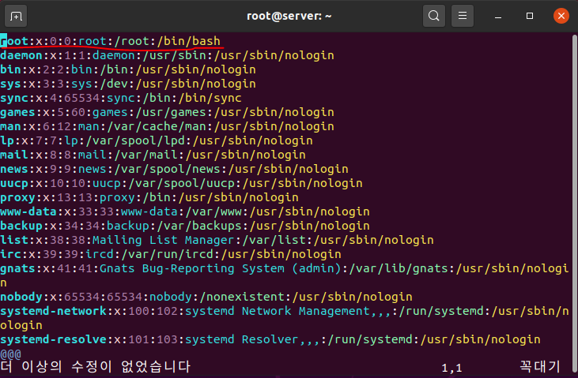
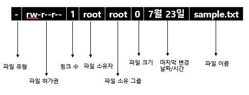

> 이 내용은 한빛미디어에서 출간한 <이것이 우분투 리눅스다> 내용을 토대로 제작 되었습니다.   
> 도서 자세히 알아보기: https://www.hanbit.co.kr/store/books/look.php?p_code=B3658372395


# 리눅스 기초 개념들(1)

## 시작하기 전에
* 유닉스/리눅스의 명령어는 대문자와 소문자를 명확하게 구분한다.
* `#` 프롬프트는 root 사용자
* `$` 프롬프트는 일반 사용자

## 가상 콘솔
* 가상의 모니터. `ctrl` + `alt` + `f2` ~ `f7`로 화면을 자유롭게 이동할 수 있다. 2번은 X 윈도로, 나머지는 텍스트 모드로 제공된다.

## 런레벨
* `init` 명령어 뒤에 붙는 숫자를 런레벨이라고 한다.  
  
|런레벨|영문 모드|설명|비고|
|:----:|:----:|:-----:|:-----:|
|0|Power Off| 종료 모드| |
|1|Rescue| 시스템 복구 모드| 단일 사용자 모드|
|2|Multi-User| | 사용하지 않음|
|3|Multi-User| 텍스트 모드의 다중 사용자 모드| |
|4|Multi-User| | 사용하지 않음|
|5|Graphical| 그래픽 모드의 다중 사용자 모드| |
|6|Reboot| | | 

런레벨 모드를 확인하려면 `/lib/systemd/system` 디렉터리의 `runlevel?.target` 파일을 확인

## 자동 완성과 히스토리
* `tab`키를 누르면 나머지 파일명이 자동으로 완성된다. 디렉터리 또는 파일이 2개 이상 존재하면 자동완성이 되지 않는다. 자동완성 기능은 속도를 올려주기도 하지만 더 중요한건 정확성이 높아져 실수를 줄일 수 있다. 

* 도스 키는 이전에 입력한 명령어를 상/하 화살표 키를 이용해서 다시 나타내는 기능을 말한다. 

## 에디터
* gedit, nano, vi 에디터를 사용한다.

  * `nano -c 파일이름` 명령으로 실행하면 커서가 움직일 때마다 아래쪽에 자동으로 행번호가 표시된다. 
  * vi 사용시 `I` 또는 `A`를 눌러서 입력모드로 바꿔 문서를 수정하고, `ESC`를 눌러서 명령모드로 바꾼뒤 `:wq`를 입력하여 저장하고 종료한다. 저장하지 않고 에디터를 닫으려면 `:q!`를 입력한다.   

### 🚫 vi 에디터에서 방향키 사용시 발생할 수 있는 문제
우분투 리눅스의 문제인지 vi 에디터에서 백스페이스와 화살표 키가 먹히지 않고 키값이 입력되는 현상이 발생하였다. 이 때 터미널에서   
```bash
sudo apt-get install vim
``` 
명령어를 사용해서 vim을 다시 설치하면서 해결하였다. 원래 vi에서는
방향키를 사용하지 않았었기 때문에 발생하는 오류로 보인다.

### vi/vim 단축키 모음
* 문자열 치환 =>  `:%s/기존문자열/새문자열` 
* 에디터 앞에 행 번호 표시 => `:set number`


출처) 원본: http://www.viemu.com/a_vi_vim_graphical_cheat_sheet_tutorial.html   
번역본: https://kldp.org/node/102947

## 도움말 사용법
* man <명령어> 로 사용한다. 
* 행 이동은 `↑, ↓` 혹은 `K, J`를 사용하고, 페이지 단위로 이동하려면 `Page Up, Page Down` 혹은 `Space bar, B`를 사용한다.

## 마운트와 CD/DVD, USB의 활용
* 마운트란 물리적인 장치를 특정한 위치(대개는 디렉터리)에 연결시켜주는 과정
    * `mount` 명령어로 현재 마운트된 장치들을 확인할 수 있다
    * 마운트 설정: `mount -o[옵션][디바이스명][마운트할 디렉토리]`
    * 마운트 해제: `umount -o[옵션][디바이스명 혹은 마운트한 디렉토리` 

## 기본 명령어들
* `ls`: 해당 디렉터리에 있는 파일의 목록을 나열한다
  - `ls -a` 숨김 파일 포함
  - `ls -l` 현재 디렉터리의 목록을 자세하게 보여줌
  - `ls *.conf` 확장자가 conf인 목록을 보여줌
  - ※숨김파일은 파일 이름이나 디렉터리의 제일 앞을 '.'으로 하면 숨김파일이 된다
* `cd`: Change Directory의 약자로 디렉터리를 이동하는 명령이다.
  - `cd` 현재 사용자의 홈 디렉터리로 이동.
  - `cd ~ubuntu` ubuntu 사용자의 홈 디렉터리로 이동
  - `cd ..` 바로 상위 디렉터리로 이동
  - `cd 절대경로/상대경로` 해당 절대경로, 상대경로로 이동
* `pwd`: Print Working Directory의 약자로 현재 디렉터리의 전체 경로를 출력한다.
* `rm`: Remove의 약자로 파일이나 디렉터리를 삭제한다. 단 현재 사용자가 파일이나 디렉터리를 삭제할 권한이 있어야 한다. root 사용자는 제한이 없다.
  - `rm abc.txt` 해당 파일 삭제(내부적으로 `rm -f`로 연결됨)
  - `rm -i abc.txt` 삭제 시 정말 삭제할 것인지 확인 메시지까지
  - `rm -f abc.txt` 삭제 시 확인하지 않고 바로 삭제
  - `rm -rf abc` abc 디렉터리와 그 아래에 있는 하위 디렉터리까지 강제로 전부 다 삭제. r은 recursive의 약자
* `cp`: 파일이나 디렉터리를 복사한다. 새로 복사한 파일은 복사한 사용자의 소유가 된다. 명령을 실행하는 사용자는 해당 파일의 읽기 권한이 필요하다.
  - `cp abc.txt def.txt` 이름을 바꿔서 abc.txt를 def.txt로 복사
  - `cp -r abc cba` 디렉터리를 복사
* `touch`: 크기가 0인 새파일을 생성하거나 이미 파일이 있으면 파일의 최종 수정 시간을 변경
* `mv`: 파일이나 디렉터리의 이름을 변경하거나 다른 디렉터리로 옮길 때 사용한다.
   - `mv abc.txt /etc/system/` abc.txt 파일을 /etc/systemd/ 디렉터리로 이동
   - `mv aaa bbb ccc ddd` aaa, bbb, ccc 파일을 /ddd 디렉터리로 이동
   - `mv abc.txt www.txt` abc.txt의 이름을 www.txt로 변경
* `mkdir`: 새로운 디렉터리를 생성. 생성된 디렉터리는 명령을 실행한 사용자의 소유가 된다.
   - `mkdir abc` 현재 디렉터리 아래에 /abc라는 디렉터리를 생성
   - `mkdir -p /qwe/asd` /qwe/asd 디렉터리를 생성하는데 asd의 부모 디렉터리가 없으면 qwe로 자동 생성해줌
* `rmdir`: 삭제권한이 있으면 해당 디렉터리를 삭제. 파일이 들어있는 디렉터리면 `rm -r`을 실행해야 된다.
* `cat`: Concatenate의 약자로 파일 내용을 화면에 보여준다.
  - `cat a.txt b.txt` a.txt와 b.txt를 연결해서 화면에 보여줌
* `head, tail`: 텍스트 형식으로 저장된 파일의 앞 10행 또는 마지막 10행만 화면에 출력한다.
  - `head -20 /etc/systemd/user.conf` 뒤 20행만 화면에 출력
  - `head -5 /etc/systemd/user.conf` 앞 5행만 화면에 출력
* `more`: 텍스트 형식으로 작성된 파일을 페이지 단위로 화면에 출력한다. `spacebar`는 다음페이지 `b`는 이전 페이지 `q`는 종료
  - `more +10 /etc/systemd/system.conf` 10행부터 출력
* `less`: more 명령어와 용도가 비슷하지만 `화살표키`와 `page up, page down` 키도 사용 가능하다
  - `less +20 /etc/systed/system.conf` 20행부터 출력
* `file`: 해당 파일이 어떤 종류의 파일인지 표시해준다.
  - `file /etc/systemd/system.conf` 텍스트 파일이므로 아스키 파일(ASCII)로 표시됨
  - `file /bin/gzip` 실행파일로 'ELF 64-bit LSB shared object'파일로 표시됨
* `clear`: 현재 사용중인 터미널 화면을 지워준다.    

## 사용자와 그룹
* 리눅스는 다중 사용자 시스템(Multi-User System)이다. 
* 기본적으로 root라는 모든 작업을 할 수 있는 권한이 있는 수퍼유저가 있다.
* 모든 사용자는 하나 이상의 그룹에 소속되어 있다.
* 사용자는 `/etc/passwd` 파일에 정의되어 있다.
  - 사용자 이름:암호:사용자id:사용자가 소속된 그룹id: 추가 정보: 홈 디렉터리: 기본 셸

* `/etc/group` 파일에서는 그룹을 확인할 수 있다
  - 그룹이름:비밀번호:그룹id:그룹에 속한 사용자 이름

* 사용자 및 그룹과 관련된 주요 명령어 
  - `adduser` 사용자를 추가(아래는 옵션) 
    - `--uid`: ID 지정
    - `--gid`: 그룹 지정
    - `--home`: 홈 디렉터리 지정
    - `--shell`: 셸 지정
  - `passwd` 사용자의 비밀번호를 지정하거나 변경
  - `usermod` 사용자의 속성을 변경
  - `userdel` 사용자를 삭제
  - `change` 사용자의 암호를 주기적으로 변경하도록 설정
  - `groups` 사용자가 소속된 그룹
  - `groupadd` 새로운 그룹을 만듦
  - `groupmod` 그룹의 속성을 변경
  - `groupdel` 그룹을 삭제
  - `gpasswd` 그룹의 암호를 설정하거나 그룹 관리를 수행

## 파일, 디렉터리의 소유권과 허가권 

* 파일 유형: 디렉터리일 경우에는 d, 일반 파일일 경우에는 -
* 파일 허가권: r은 read, w는 write, x는 execute의 약자
  - 첫 번째 3자리는 소유자의 파일접근 권한
  - 두 번째 3자리는 그룹의 파일접근 권한
  - 세 번째 3자리는 그 외의 사용자의 파일접근 권한
  - 숫자로도 표시 가능(8진수)
    + `rw-`는 4+2+0=6 `r--`는 4+0+0=4 `rwx`는 4+2+1=7
    + 파일 허가권이 754라는 뜻은 `rwxr-xr--` 이므로 소유자는 읽고/쓰고/실행할 수 있고, 그룹은 읽고 실행만 되고, 그 외 사용자는 읽을 수만 있다는 것이다. 
  - 디렉터리는 해당 디렉터리로 이동하려면 실행 권한(x)이 반드시 있어야 한다. 
* `chmod`: 파일 허가권 변경 명령어
  - `chmod 777 sample.txt` 명령어는 모든 사용자가 읽고, 쓰고, 실행할 수 있도록 파일의 허가권을 변경한다.
* `chown/chgrp`: 파일의 소유권을 변경하는 명령어. 보안상으로도 중요하기 때문에 root 사용자만 사용가능
  - `chown 새로운사용자이름(.새로운그룹이름) 파일이름`
    + `chown ubuntu.ubuntu sample.txt`는 파일의 사용자와 그룹 모두 ubuntu로 바꾸라는 의미
    + `chgrp centos sample.txt`는 그룹만 centos 그룹으로 변경

## 링크 
  
  * inode는 리눅스/유닉스 파일 시스템에서의 자료구조로서 파일이나 디렉터리의 정보들(해당 파일의 소유권, 허가권, 파일 종류, 해당 파일의 실제 데이터 주소 등)이 담겨있다.  

※ 하드링크를 생성하는 `ln 링크대상파일이름 링크파일이름`과 다르게 `cp`명령으로 파일을 복사하면 inode 블록도 다를뿐아니라 원본파일에 영향을 끼치지 않는다. 

## 프로그램 설치를 위한 dpkg
* dpkg는 Windows의 "setup.exe"와 비슷한 설치 파일
* 확장명은 *.deb이며, 이를 패키지(Package)라고 부름
  * 패키지이름_버전-개정번호_아키텍처.deb 형식
* 설치: `dpkg -i 패키지이름.deb` 
* 삭제: `dpkg -r 패키지이름` 기존에 설치된 패키지 삭제        
        `dpkg -P 패키지이름` 설정 파일까지 모두 제거
* 조회: `dpkg -l 패키지이름` 설치된 패키지에 대한 정보  
        `dpkg -L 패키지이름` 패키지가 설치한 파일 목록을 보여줌
* 아직 설치되지 않은 deb 파일 조회는 `dpkg --info 패키지이름.deb`
* dpkg 명령의 단점
  * '의존성' 문제 
    * A패키지가 설치되기 위해서 B패키지가 필요한 경우, dpkg 명령으로는 해결이 까다로움
    * 이를 해결하기 위한 것이 `apt`

## 편리한 패키지 설치, apt
* 의존성 문제를 완전하게 해결함
* 인터넷을 통하여 필요한 파일을 저장소(Repository)에서 자동으로 모두 다운로드해서 설치하는 방식
* 저장소의 URL은 /etc/apt/sources.list 파일
* 기본 설치: `apt install 패키지이름` 
  * 주로 `apt -y install 패키지이름`으로 쓰는데 여기서 'y'는 사용자의 확인을 모두 'yes'로 간주하고 설치를 진행한다는 옵션
* 패키지 목록의 업데이트: `apt update`
  * sources.list 파일의 내용이 수정되면 이 명령으로 다운로드 받을 패키지 목록을 업데이트 해야한다.
* 삭제: `apt remove/purge 패키지이름`
* 사용하지 않는 패키지 제거: `apt autoremove`
* 내려 받은 파일 제거: `apt clean 또는 apt autoclean`
* `apt-cache`: 패키지를 설치하기 전에 패키지에 대한 정보나 의존성 문제를 미리 확인

✅ 실행 시간이 오래걸리는 명령들은 세미콜론(;)으로 구분해서 한꺼번에 실행시키자

## apt 작동 방식
* apt install 입력 => /etc/apt/sources.list 파일을 열어서 URL 주소 확인 => 설치와 관련된 패키지 목록을 요청 => 전체 패키지 목록 파일만 다운로드 => 설치할 패키지와 관련된 패키지의 이름을 화면에 출력 => y를 입력하면 설치에 필요한 패키지 파일 요청 => 설치할 패키지 파일을 다운로드해서 자동 설치
* 우분투 패키지 저장소에는
  * main: 우분투 공식 지원 / 무료 소프트웨어
  * universe: 우분투 지원 X / 무료 소프트웨어
  * restricted: 우분투 공식 지원 / 유료 소프트웨어
  * multiverse: 우분투 지원 X / 유료 소프트웨어가 존재한다

## 파일의 압축과 묶기
* 압축파일 확장명은 xz, bz2, gz, zip, Z 등이 있고 xz나 bz2 압축률이 더 좋다. 
  * `xz 파일이름` 기존 파일은 삭제되면서 '파일이름.xz'로 압축
  * `xz -d 파일이름` 압축풀기
* 리눅스(유닉스)에서는 '파일 압축'과 '파일 묶기'는 원칙적으로 별개의 프로그램으로 수행
* 파일 묶기의 명령어는 'tar'이며, 묶인 파일의 확장명도 'tar'이다. 
  * 동작: c(묶기), x(풀기), t(경로확인)  
    옵션: f(파일), v(과정보이기),J(tar+xz), z(tar+gzip), j(tar+bzip2)
    * `tar cvf my.tar /etc/systemd/`: 묶기
    * `tar cvfJ my.tar.xz /etc/systemd/`: 묶기 + xz 압축
    * `tar xvf my.tar`: tar 풀기
    * `tar xvfJ my.tar.xz`: xz 압축해제 + tar풀기 

## 파일 위치 검색
* find [경로][옵션][조건][action]: 기본 파일 찾기
  * [옵션]: -name, -user(소유자), -newer(전,후), -perm(허가권), -size(크기)
  * [action] -print(디폴트), -exec(외부명령 실행)
   
    `find /home -name "*.swap" -exec rm {}\;`

    => find 명령어의 실행 결과인 swp 파일을 rm 명령으로 실행해라
* 그 외에 `which, whereis, locate` 등이 있다.

## 시스템 설정
* `gnome-control-center`: 시스템 설정 
* `nmtui`: 네트워크 설정
* `ufw/gufw`: 방화벽 설정

## CRON과 AT
* cron: 주기적으로 반복되는 일을 자동적으로 실행될 수 있도록 설정
* 관련된 데몬(서비스)은 "crond", 관련 파일은 "/etc/crontab"
  * 분 시 일 월 요일 사용자 실행명령
    * ex) `00 05 1 * * root cp -r /home /backup`   
      매 월 1일 5시에 /home 디렉토리 폴더를 백업해라
* at: 일회성 작업을 예약 
  * `at now + 1 hours`  
    at> 프롬프트에 예약 명령어 입력후 `Enter`   
    완료되면 `Ctrl + D`  
    확인: `at -l` 
    취소: `atrm <작업번호>`    