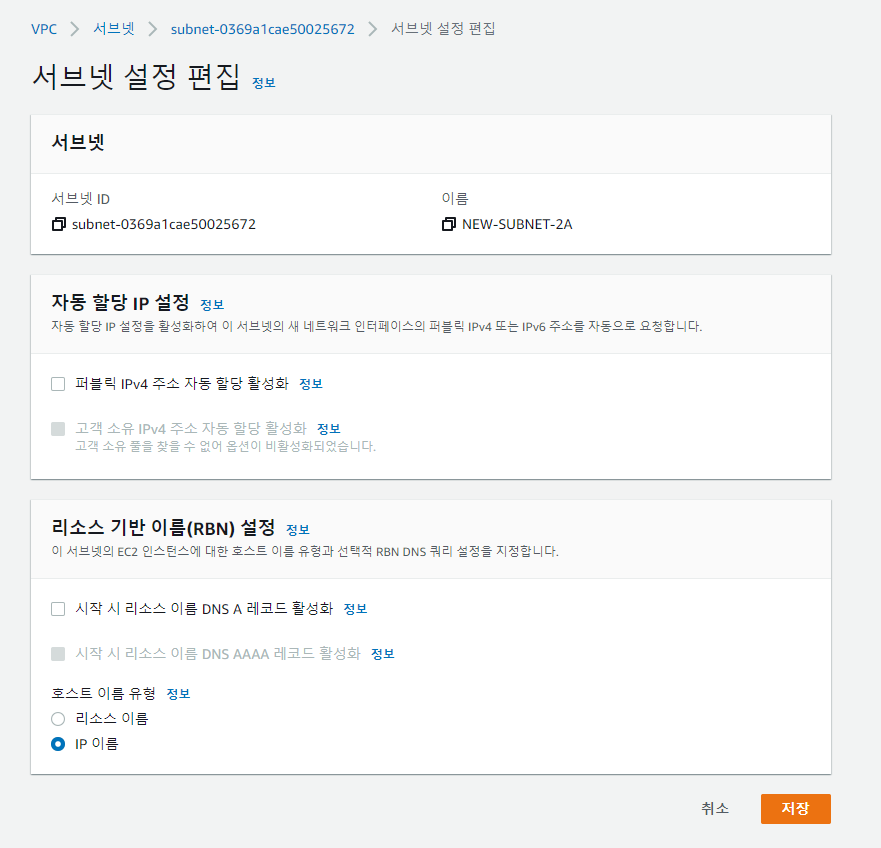
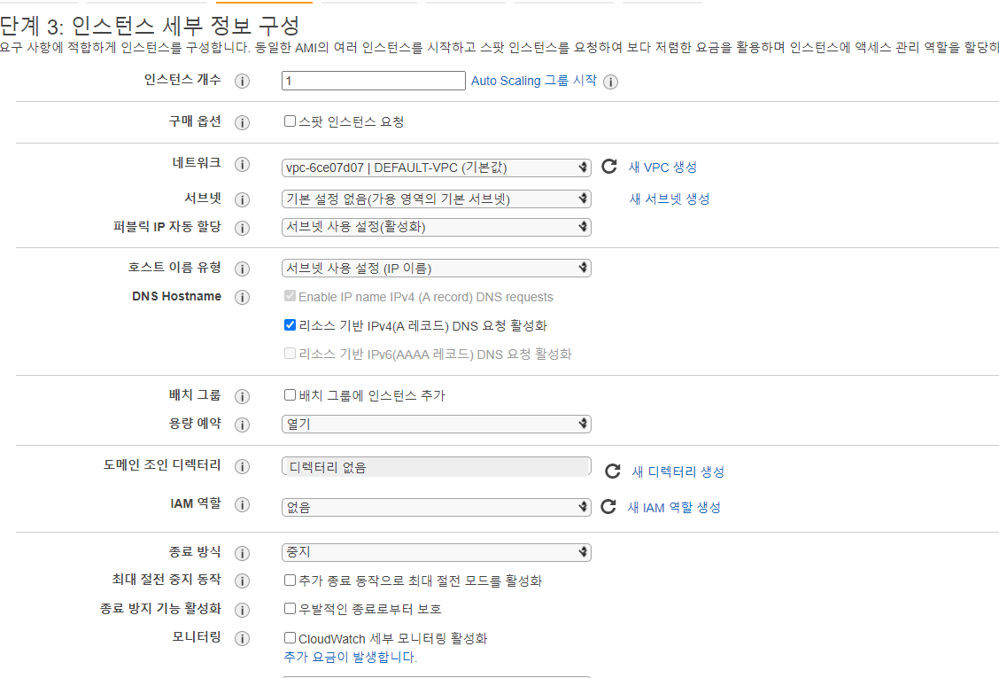
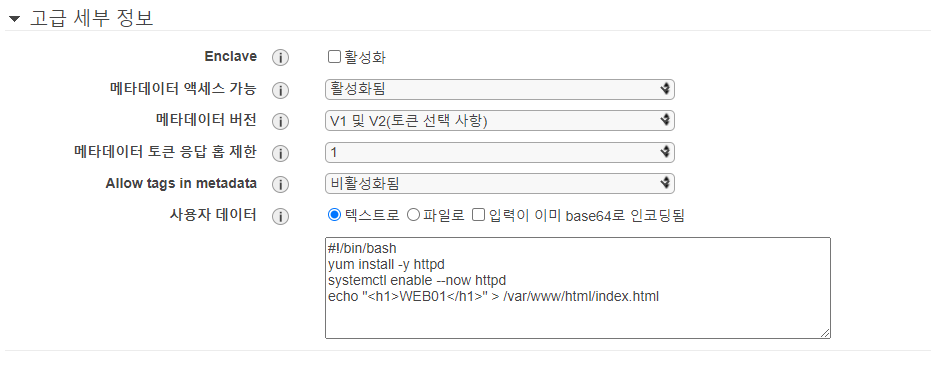
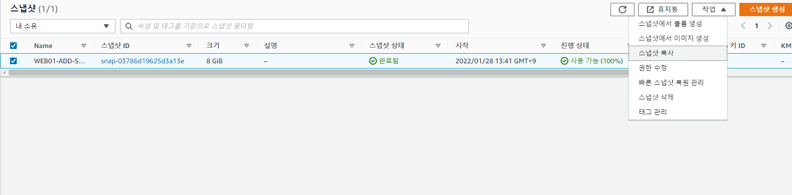
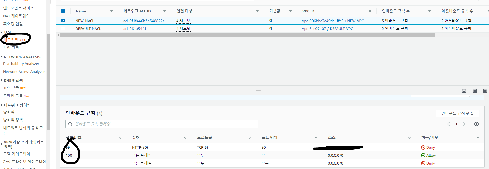
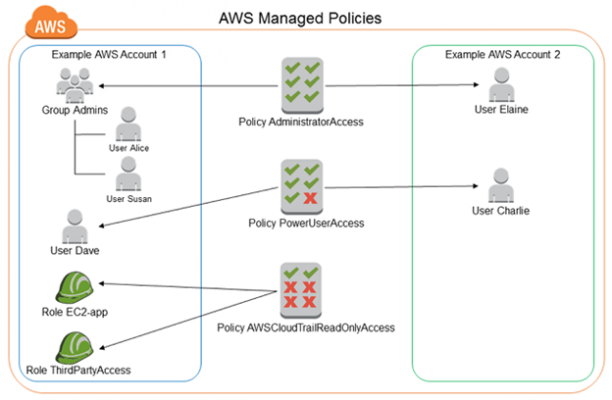
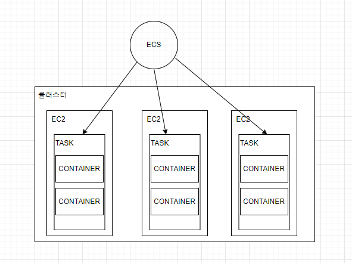
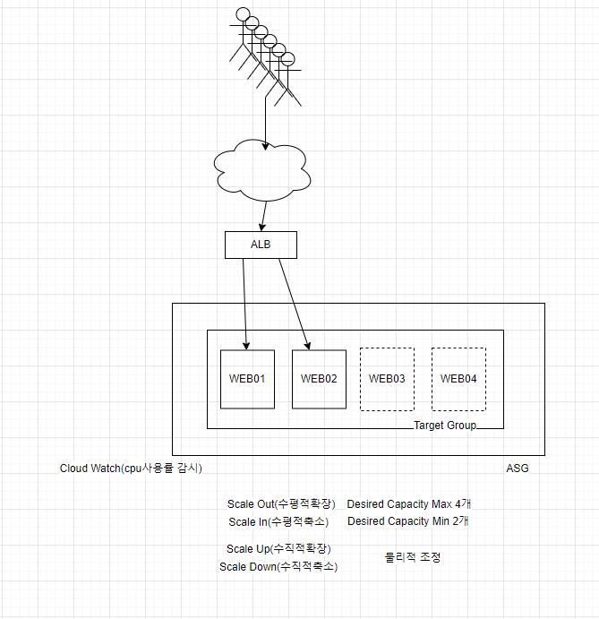

## Amazon VPC
사용자가 정의한 가상 네트워크로 AWS 리소스를 시작할 수 있다. 이 가상 네트워크는 AWS의 확장 가능한 인프라를 사용한다는 이점과 함께 고객의 자체 데이터 센터에서 운영하는 기존 네트워크와 매우 유사하다.

* Virtual Private Cloud(VPC) : 사용자의 AWS 계정 전용 가상 네트워크. 전체 네트워크 주소 범위는 172.31.0.0/16 (리전 단위)

* 서브넷: 각각의 AZ에 1개씩 네트워크 주소가 할당된 VPC의 IP 주소 범위
172.31.0.0/20, 172.31.16.0/20, 172.31.32.0/20 172.31.48.0/20(AZ단위)

* 라우팅 테이블: 네트워크 트래픽을 전달할 위치를 결정하는 데 사용되는 라우팅이라는 규칙 집합. 172.31.0.0/16 (서브넷 단위)

* 인터넷 게이트웨이: VPC의 리소스와 인터넷 간의 통신을 활성화하기 위해 VPC에 연결하는 게이트웨이. 라우팅 테이블에 할당된다. (VPC 단위)

* Network ACL: Inbound(내부로의 통신), Outobound(외부로의 통신)를 기반으로 모든 통신을 허가한다. (서브넷 단위)

* Security Group: Inbound(내부로의 통신)는 모든 통신을 거부한다. outbound(외부로의 통신)은 모든 통신을 허가한다. 

* Region
   - ap-northeast-2 서울리전
   - ap-northeast-2a 가용영역a (1개 이상의 데이터센터)
   - ap-northeast-2b 가용영역b
   - ap-northeast-2c 가용영역c
   - ap-northeast-2d 가용영역d

## VPC를 활용하여 EC2 설정 




* 사용자 데이터 부분에 인스턴스가 생성될 때 실행시킬 명령어를 입력할 수 있다. 루트 권한으로 실행되기 때문에 sudo와 같은 명령어가 필요없다. 
 
```sh
# ec2를 도커 호스트로 생성하는 명령어
#!/bin/bash
amazon-linux-extras install docker -y
systemctl enable --now docker 
curl https://raw.githubusercontent.com/docker/docker-ce/master/components/cli/contrib/completion/bash/docker -o /etc/bash_completion.d/docker.sh
docker run -d -p 80:80 --name web02 koentc010/test_build:v2.0
usermod -a -G docker ec2-user
``` 


* Route53 호스팅 영역에서 도메인 이름(ex. star.com)에 대한 네임서버 주소를 부여받고, A유형 레코드(IPv4주소 라우팅, www.star.com ->1.2.3.4 /web.star.com -> 5.6.7.8 등...), CNAME(www.star.com -> web.star.com)과 같이 등록하면 해당 도메인을 호스팅할 수 있게 된다. 이러한 과정이 DNS 레코드 관리이다.

## 3대 스토리지 서비스 
1. 블록 스토리지: EBS
2. 파일 스토리지: EFS
    - 네트워크 공유폴더(Linux NFS)
3. 객체 스토리지: S3
     - 외부로 링크를 생성(https 등)한다는 특징 

* 볼륨을 생성한 후에는 동일한 가용 영역에 있는 인스턴스에만 볼륨을 연결할 수 있다.

```sh
sudo file -s /dev/xvdf
sudo mkfs -t xfs /dev/xvdf # 포맷 
lsblk
#NAME    MAJ:MIN RM SIZE RO TYPE MOUNTPOINT
#xvda    202:0    0   8G  0 disk
#└─xvda1 202:1    0   8G  0 part /
#xvdf    202:80   0   8G  0 disk
sudo mkdir /data
sudo mount /dev/xvdf /data # 마운트
lsblk
#NAME    MAJ:MIN RM SIZE RO TYPE MOUNTPOINT
#xvda    202:0    0   8G  0 disk
#└─xvda1 202:1    0   8G  0 part /
#xvdf    202:80   0   8G  0 disk /data

docker save -o test_build.tar koentc010/test_build:v1.0
sudo mv test_build.tar /data
unmount /data # 마운트 해제
```

## EBS Snpashot 
EBS 볼륨의 특정 시점 스냅샷을 생성하여 새 볼륨이나 데이터 백업의 기준으로 사용할 수 있다. 볼륨의 스냅샷이 주기적으로 생성되는 경우 스냅샷은 증분식이어서 새 스냅샷은 마지막 스냅샷 이후 변경된 블록만 저장한다. 연결되어 사용 중인 볼륨의 스냅샷도 만들 수 있다. 하지만 스냅샷 명령을 실행할 때 Amazon EBS 볼륨에 기록된 데이터만 캡처한다. 이 때 애플리케이션이나 운영 체제에 의해 캐시된 데이터가 제외될 수 있다. 

* 볼륨의 가용 영역이 달라서 마운트가 안될 때, 스냅샷으로 볼륨을 만들어 다른 가용 영역에서 사용할 수 있도록 활용 가능 



## AWS RDS

* RDS(Relational Database Service)  
    * 클라우드 기반 관계형 데이터 베이스
    * 데이터베이스 설정, 모니터링, 프로비저닝 등을 자동화하여 개발에만 집중 가능

## EC2와 RDS 연동시 주의사항
1. RDS의 보안그룹 설정 변경. VPC 내웹서버의 IP를 인바운드 규칙에 추가시켜주어야 한다. 
2. RDS 자원을 삭제할 때 최종 스냅샷을 생성하면 과금됨

## S3
* 개별파일 링크를 생성하여 퍼블릭하게도 사용 가능하다는 점이 구글 드라이버와 다르다. 
* 정적 웹사이트로도 사용 가능하다.


## Elastic Load Balancer(ELB)   
https://aws-hyoh.tistory.com/128  
https://aws-hyoh.tistory.com/133
## 네트워크 ACL(Access Control List) vs 보안 그룹
|네트워크 ACL|보안그룹|
|---|---|
|서브넷 레벨에서 운영|인스턴스 레벨에서 운영|
|허용 및 거부 규칙 지원|허용 규칙만 지원|
|상태 비저장: 반환 트래픽이 규칙에 의해 명시적으로 허용되어야 함| 상태 저장: 규칙에 관계없이 반환 트래픽이 자동으로 혀용됨|
|트래픽 허용 여부를 결정할 때 번호가 가장 낮은 규칙부터 순서대로 규칙을 처리|트래픽 허용 여부를 결정하기 전에 모든 규칙을 평가함|
|연결된 서브넷의 모든 인스턴스에 자동 적용됨(보안 그룹 규칙이 지나치게 허용적일 경우 추가 보안 계층 제공)|인스턴스 시작 시 누군가 보안 그룹을 지정하거나, 나중에 보안 그룹을 인스턴스와 연결하는 경우에만 인스턴스에 적용됨|

* VPC -> 네트워크 ACL 화면


## IAM(Identity and Access Management)
AWS 서비스에 대한 액세스를 안전하게 제어하는 웹 서비스. IAM을 통해 사용자, 액세스 키와 같은 보안 자격 증명, 사용자와 애플리케이션이 어떤 AWS 리소스에 액세스할 수 있는지 제어하는 권한을 한 곳에서 관리할 수 있다.   


* MFA(Multy Factor Authentication) 

### 주의사항: 루트 사용자의 MFA가 등록된 OTP 어플을 지우면 루트 사용자에 접근할 수 없다. AWS 본사와 통화해야함!! 

## Amazon ECS
Amazon Elastic Container Service(Amazon ECS)는 클러스터에서 Docker 컨테이너를 손쉽게 실행, 중지 및 관리할 수 있게 해주는 컨테이너 관리 서비스로서 확장성과 속도가 뛰어나다. Amazon ECS는 시작 유형을 사용하여 Fargate에서 관리하는 서버를 사용하지 않는 인프라에서 클러스터를 호스팅할 수 있다. 인프라에 대한 더 세부적인 제어를 위해 EC2 시작 유형을 사용하여 관리하는 EC2 인스턴스의 클러스터에서 작업을 호스팅할 수 있다.  

* 작업 정의(Task) => 컨테이너를 담는 그릇 

## 오토스케일링


