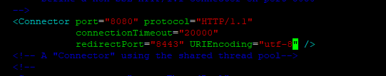

# 에러 났던 것들 정리

1. was를 톰캣을 사용할 때 url에 한글을 인식못하는 경우
      
connector 부분에 URIEncoding="utf-8"을 추가한다.

 

2. ec2 인스턴스 내부 폴더에 이미지 저장이 안되었는데 해당 디렉토리에 쓰기 권한이 없어서 발생한 문제였다.   
**`home/ec2-user`와 같이 사용자의 루트폴더 권한을 함부로 바꾸면 ssh 접속조차 불가능하게 된다. 주의!**