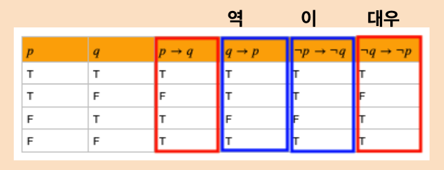

# 자바문법 찾아보기 

[2차원 배열 정렬 방법](#2차원-배열-정렬-방법)

[Comparable과 Comparator의 이해](https://st-lab.tistory.com/243)

[Comparator 인터페이스에는 왜 추상메소드가 2개일까?](https://mkyong.com/java8/is-comparator-a-function-interface-but-it-has-two-abstract-methods/) :
함수형 인터페이스는 한 개의 추상메소드만 가질 수 있는데, Comparator 함수형 인터페이스는 추상메소드가 2개라 발생한 의문점

[제네릭의 이해](https://st-lab.tistory.com/153)

[JAVA 제네릭 배열을 생성하지 못하는 이유](https://pompitzz.github.io/blog/Java/whyCantCreateGenericsArray.html#%E1%84%92%E1%85%A7%E1%86%BC%E1%84%87%E1%85%A7%E1%86%AB%E1%84%92%E1%85%A1%E1%86%AB-%E1%84%8B%E1%85%B5%E1%84%8B%E1%85%AD%E1%86%BC%E1%84%92%E1%85%A1%E1%84%80%E1%85%B5)
 
[람다식의 타입과 multiple bounds를 활용한 형변환](#람다식의-타입과-형변환)  

[BigDecimal 사용법 정리](https://jsonobject.tistory.com/466) 

[메서드 참조와 같은 기능을 하는 람다 표현](#메서드-참조와-같은-기능을-하는-람다-표현)

[synchronized 정리](https://velog.io/@backtony/Java-synchronized-%EB%8F%99%EA%B8%B0%ED%99%94) 

[Stream.collect() 분석](#streamcollect-분석)

---

## 2차원 배열 정렬 방법
 https://gre-eny.tistory.com/m/2  

(추가로 보면 좋은 객체 배열 정렬하기: https://codevang.tistory.com/288) => Arrays.sort 함수에서 사용되는 Comparable, Comparator의 compareTo, compare 함수의 파라미터로 들어오는 기준값이 직관적으로 생각하는 것의 반대이기 때문에 음수일 경우 두 요소의 위치를 바꾸고, 양수일 경우 두 요소의 위치를 그대로 두는 것이 맞다. 하지만 직관적으로 순서대로 파라미터를 비교한다고 생각해보자(역). 두 수의 차가 음수이면 위치를 그대로 두고, 양수이면 바꾼게 된다(역). {1, 5} 라는 배열을 예로 들면, p(5, 1 순서로 비교, 5 - 1) -> q(비교 결과가 양수면 안바꾸고, 음수면 바꾼다)가 참일 때, ~p(1, 5 순서로 비교, 1 - 5) -> ~q(비교 결과가 양수면 바꾸고, 음수면 안바꾼다)이 되면서 '이'의 관계가 된다. p와 q가 모두 참이면, 이도 참이기 때문에 직관적으로 이해해도 문제는 없지만, 비교함수의 리턴을 -1, 1로 사용할 때 원하는 결과의 반대의 결과를 얻을 수 있으니 정석대로 사용하자.  



명제: 30이 10보다 크다면, 30은 50보다 크다. 
p: 30이 10보다 크다 (참)
q: 30은 50보다 크다 (거짓)

p -> q 30이 10보다 크다면, 30은 50보다 크다. (거짓)
q -> p 30이 50보다 크다면, 30은 10보다 크다. (참)
~p -> ~q 30이 10보다 작다면, 30은 50보다 작다 (참)
~q -> ~p 30이 50보다 작다면, 30은 10보다 작다. (거짓)

```
여기서 의문. 전제가 거짓인데 p -> q가 참일까? 
https://m.blog.naver.com/PostView.naver?isHttpsRedirect=true&blogId=kyj0833&logNo=220990303979

Elementary Logic파트에서는  위의 표와 같이 p → q에 대한 진리표를 다룹니다.  그런데 여기서 대부분의 인간은 전제가 F 이면 왜  p → q가 항상 참인지에 대해 의문을 가지기 마련입니다. 일상 언어에서는 'p 이면 q이다'라는 명제는 p가 거짓일 경우에 nonsense라고 받아들여집니다. 하지만 형식적 언어를 다룸에 있어서 논리학자들은 이러한 경우에도 진릿값을 부여하고 싶은 거죠~. 그리고 여러 이유로 인하여, 논리학자들은  '전제가 거짓인 경우 해당 명제는 참이다'라는 결론에 정착합니다.

여기까지가 교수님들이 하시는 말씀, 책에 나온 내용일 겁니다. 근데 그 여러 이유가 궁금하다는 거잖아요?

이것이 무슨 이야기를 하는 것이냐면,
일단 가정이 false일 때는 아무 의미가 없습니다. 이 조건문이라는게 전제가 참일 때만 우리가 그명제를 참인지 거짓인지 결정할 수가있어요. 그런데 왜 굳이 전제가 거짓일 경우에 대해 참이라는 값을 줬을까요?  전제가 거짓일 경우에 대해,  'P이면 P이다' 라는 명제를 생각해봅시다. 생각할 것도 없이 이 명제는 항상 참입니다. P가 거짓일 때에 대해서도 말입니다.  이는 아래 표와 같은 상황입니다.                   

P     P      P -> P
F     F        T

⇒전제가 거짓이고 ,해당 명제는 참이라는 값을 가집니다. 그런데 만약 표의 T 값을 F라고 하고싶어진다면, 그 말은 P→P는 항상 참이라는 사실에 위배됩니다. 따라서 이러한 모순들을 피하기 위해 논리학에서는 '전제가 거짓이면 해당 명제는 항상 참이다.'라는 것이 가장 무난한 선택이라고 하는 것입니다.

이에 대한 동의가 없다면 뒤에 나올 여러 증명이 진행되지 않습니다. 너무 깊이 이해할 필요까지는 없어보이나 어떠한 느낌인지는 알고 넘어가도록 합시다.
```

```java 
package codingtest;

import java.util.Arrays;
import java.util.Comparator;

public class Combination {
	public static void main(String[] ar) {

		testComparable test1 = new testComparable(1);
		testComparable test2 = new testComparable(5);
		testComparable[] arr = new testComparable[] { test1, test2 };
		
		System.out.println("====================");
		System.out.print("최초 순서 : ");
		for (int i = 0; i < arr.length; i++) {
			System.out.print(arr[i].getA() + " ");
		}
		
		System.out.println();
		System.out.println("====================");
		System.out.println("1) 단순 compareTo: arr[0].compareTo(arr[1])");
		System.out.println("--------------------");
		System.out.print("결과: " + arr[0].compareTo(arr[1]));
		System.out.println();
		System.out.println("--------------------");
		System.out.println("2) Arrays.sort()에서 사용되는 Comparable의 compareTo");
		System.out.println("--------------------");
		System.out.print("정렬 전 : ");
		for (int i = 0; i < arr.length; i++) {
			System.out.print(arr[i].getA() + " ");
		}
		System.out.println();
		System.out.println("--------------------");
		Arrays.sort(arr);
		System.out.print("정렬 후 : ");
		for (int i = 0; i < arr.length; i++) {
			System.out.print(arr[i].getA() + " ");
		}
		System.out.println();
		System.out.println("--------------------");
		

		class Sort implements Comparator<testComparable> {

			@Override
			public int compare(testComparable o1, testComparable o2) {
				System.out.println("Sort 객체 param1: " + o1.getA());
				System.out.println("Sort 객체 param2: " + o2.getA());
				if (o1.getA() < o2.getA()) {
					System.out.println("compare 리턴: -1");
					return -1;
				}
				System.out.println("compare 리턴: 1");
				return 1;
			}
		}
		
		System.out.println("3) Arrays.sort()에서 사용되는 Comparator의 compare");
		System.out.println("--------------------");
		System.out.print("정렬 전 : ");
		for (int i = 0; i < arr.length; i++) {
			System.out.print(arr[i].getA() + " ");
		}
		System.out.println();
		System.out.println("--------------------");
		Arrays.sort(arr, new Sort());
		System.out.print("정렬 후 : ");
		for (int i = 0; i < arr.length; i++) {
			System.out.print(arr[i].getA() + " ");
		}
		System.out.println();
		System.out.println("-----------------");
		
	}
}

class testComparable implements Comparable<testComparable> {

	private int a;

	public testComparable(int a) {
		super();
		this.a = a;
	}

	@Override
	public int compareTo(testComparable o) {
		System.out.println("testComarable 객체: " + this.getA());
		System.out.println("testComparable param: " + o.getA());
		if (this.a < o.a) {
			System.out.println("compareTo 리턴: -1");
			return -1;
		}

		System.out.println("compareTo 리턴: 1");
		return 1;
	}

	public int getA() {
		return a;
	}
}
/*
====================
최초 순서 : 1 5 
====================
1) 단순 compareTo: arr[0].compareTo(arr[1])
--------------------
testComarable 객체: 1
testComparable param: 5
compareTo 리턴: -1
결과: -1
--------------------
1) Arrays.sort()에서 사용되는 Comparable의 compareTo
--------------------
정렬 전 : 1 5 
--------------------
testComarable 객체: 5
testComparable param: 1
compareTo 리턴: 1
정렬 후 : 1 5 
--------------------
1) Arrays.sort()에서 사용되는 Comparator의 compare
--------------------
정렬 전 : 1 5 
--------------------
Sort 객체 param1: 5
Sort 객체 param2: 1
compare 리턴: 1
정렬 후 : 1 5 
-----------------


*/
```


## 람다식의 타입과 형변환 

함수형 인터페이스로 람다식을 참조할 수 있는 것일 뿐, 람다식의 타입이 함수형 인터페이스의 타입과 일치하는 것은 아니다. 람다식은 익명 객체이고, 익명 객체는 타입이 없다. 정확히는 타입이 있지만 컴파일러가 임의의 이름을 정하기 때문에 알 수 없는 것이다. 그래서 대입 연산자의 양변의 타입을 일치시키기 위해 아래와 같이 형변환이 필요하다.

```java
MyFunction f = (MyFunction) (() -> {}); // 양변의 타입이 다르기때문에 형변환이 필요, 형변환 생략가능
```

람다식은 Object타입으로 형변환은 할 수없다. 그럼에도 Object타입으로 형변환을 하려면 함수형 인터페이스로 형변환을 먼저 해야한다.

```java 
Object obj = (Object) (() -> {}); // Error, 함수형 인터페이스만 형변환 가능
Object obj = (Object) (MyFunction) (() -> {}); // 함수형 인터페이스로 먼저 형변환, Object타입으로 다시 형변환
String str = ((Object) (MyFunction) (() -> {})).toString();
```

### (class & interface) 형변환 표현
https://docs.oracle.com/javase/tutorial/java/generics/bounded.html  
https://docs.oracle.com/javase/specs/jls/se8/html/jls-15.html#jls-15.16 

자바 8이후에 Multiple Bounds가 가능하다. 

### multiple bounds를 활용한 람다직렬화
https://stackoverflow.com/questions/22807912/how-to-serialize-a-lambda

```java 
Runnable r = (Runnable & Serializable)() -> System.out.println("Serializable!");

// Note: this only works if you apply the cast during construction. The following will throw a ClassCastException: 
Runnable r = () -> System.out.println("Serializable!"); 
Runnable serializableR = (Runnable & Serializable) r;
```

익명 클래스보다는 람다를 사용하라(맨 아래쪽 람다와 직렬화) https://javabom.tistory.com/66   
람다를 직렬화하지 말라는데 이유는 뭘까? https://techblog.woowahan.com/2551/

## 메서드 참조와 같은 기능을 하는 람다 표현

다음 표는 이펙티브 자바 Item 43에서 인용한 것이다.(2023.04.12 이해 위한 예시추가)
|메서드 참조유형|예|같은 기능을 하는 람다|
|---|---|---|
|정적|Integer::parseInt|str -&gt; Integer.parseInt(str)|
|한정적(인스턴스)|Instant.now()::isAfter|Instant then = Instant.now(); <br> t-&gt; then.isAfter(t)
| |System.out::println| str -> System.out.println(str); |
| |<br>str::length<br>str::replaceAll |String str = new String();<br> () -> str.length()<br>(regexp, replacement) -> str.replaceAll(regexp, replacement)|
|비한정적(인스턴스)|String::toLowerCase<br>String::compareToIgnoreCase|str -> str.toLowerCase()<br>(str1, str2) -> str1.compareToIgnoreCase(str2)|
|클래스 생성자|TreeMap<K,V>::new|() -> new TreeMap<K,V>()|
|배열 생성자|int[]::new|len -> new int[len]|

## Stream.collect() 분석

1. Stream.collect() 사용 방법 및 예제 
https://codechacha.com/ko/java8-stream-collect/

2. Stream.collect() 분석 
https://jerry92k.tistory.com/m/24?category=981716

3. collect(Supplier supplier, BiConsumer accumulator, BiConsumer combiner) 사용시 발생한 문제점과 해결 방안 사례 
https://stackoverflow.com/questions/29959795/how-does-combiner-in-stream-collect-method-work-in-java-8

