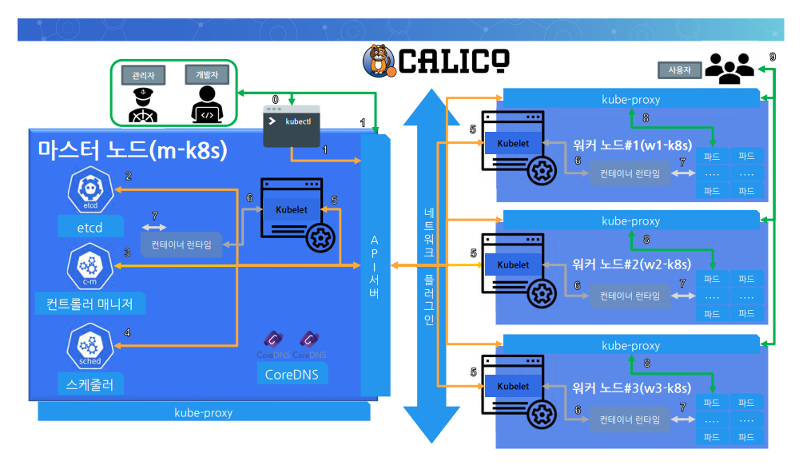

# 쿠버네티스
* 파드(Pod) = 한 가지 일을 하는 단위 / 컨테이너들의 집합

```sh
[root@m-k8s ~]# kubectl get nodes
NAME     STATUS   ROLES                  AGE   VERSION
m-k8s    Ready    control-plane,master   17h   v1.20.2
w1-k8s   Ready    <none>                 17h   v1.20.2
w2-k8s   Ready    <none>                 17h   v1.20.2
w3-k8s   Ready    <none>                 17h   v1.20.2

파드 배포
[root@m-k8s ~]# kubectl run nginx --image=nginx
pod/nginx created

파드가 노드에서 실행 중인지 확인
[root@m-k8s ~]# kubectl get pod -o wide
NAME    READY   STATUS    RESTARTS   AGE
nginx   1/1     Running   0          20s
```

* 쿠버네티스에서 서비스란? 다른 어떤 곳으로 가기 위해 항상 거쳐가야 하는 곳

```sh
배포한 pod를 외부에서 접속
[root@m-k8s ~]# kubectl expose pod nginx --type=NodePort --port=80
service/nginx exposed

서비스의 ip 확인
[root@m-k8s ~]# kubectl get service
NAME         TYPE        CLUSTER-IP     EXTERNAL-IP   PORT(S)        AGE
kubernetes   ClusterIP   10.96.0.1      <none>        443/TCP        17h
nginx        NodePort    10.103.89.14   <none>        80:32189/TCP   18s

[root@m-k8s ~]# kubectl get nodes -o wide
NAME     STATUS   ROLES                  AGE   VERSION   INTERNAL-IP     EXTERNAL-IP   OS-IMAGE                KERNEL-VERSION                CONTAINER-RUNTIME
m-k8s    Ready    control-plane,master   17h   v1.20.2   192.168.1.10    <none>        CentOS Linux 7 (Core)   3.10.0-1127.19.1.el7.x86_64   docker://19.3.14
w1-k8s   Ready    <none>                 17h   v1.20.2   192.168.1.101   <none>        CentOS Linux 7 (Core)   3.10.0-1127.19.1.el7.x86_64   docker://19.3.14
w2-k8s   Ready    <none>                 17h   v1.20.2   192.168.1.102   <none>        CentOS Linux 7 (Core)   3.10.0-1127.19.1.el7.x86_64   docker://19.3.14
w3-k8s   Ready    <none>                 17h   v1.20.2   192.168.1.103   <none>        CentOS Linux 7 (Core)   3.10.0-1127.19.1.el7.x86_64   docker://19.3.14
```

* 파드를 여러개 사용 => Deployment를 통해 파드를 배포
```sh
파드 1개
[root@m-k8s ~]# kubectl create deployment deploy-nginx --image=nginx
deployment.apps/deploy-nginx created

파드 여러개
[root@m-k8s ~]# kubectl scale deployment deploy-nginx --replicas=3
deployment.apps/deploy-nginx scaled


[root@m-k8s ~]# kubectl get pods
NAME                            READY   STATUS    RESTARTS   AGE
deploy-nginx-8458f6dbbb-gs5sn   1/1     Running   0          3m42s
deploy-nginx-8458f6dbbb-jg54c   1/1     Running   0          40s
deploy-nginx-8458f6dbbb-lbf79   1/1     Running   0          40s
nginx                           1/1     Running   0          42m
```

* 디플로이먼트를 노드포트로 노출 
```sh
[root@m-k8s ~]# kubectl expose deployment deploy-nginx --type=NodePort --port=80
```
* 디플로이먼트를 노출하는 가장 좋은 방법: 로드밸런서
  - 노드포트의 ip를 노출시킬 필요가 없다.(보안)
  - 경로를 최적화할 수 있다.


* metallb를 이용해서 chk-hn 파드 생성 후 로드밸런싱 하기
```sh
[root@m-k8s ~]# kubectl apply -f ~/_Lecture_k8s_starter.kit/ch2/2.4/metallb.yaml
[root@m-k8s ~]# kubectl create deployment chk-hn --image=sysnet4admin/chk-hn
deployment.apps/chk-hn created
[root@m-k8s ~]# kubectl scale deployment chk-hn --replicas=3
deployment.apps/chk-hn scaled

[root@m-k8s ~]# kubectl expose deployment chk-hn --type=LoadBalancer --port=80
service/chk-hn exposed
[root@m-k8s ~]# kubectl get services
NAME           TYPE           CLUSTER-IP       EXTERNAL-IP    PORT(S)        AGE
chk-hn         LoadBalancer   10.106.139.160   192.168.1.11   80:31239/TCP   10s

```

* 배포한 것들 모두 삭제
```sh
[root@m-k8s ~]# kubectl delete service chk-hn
service "chk-hn" deleted
[root@m-k8s ~]# kubectl delete service deploy-nginx
service "deploy-nginx" deleted
[root@m-k8s ~]# kubectl delete service nginx
service "nginx" deleted

[root@m-k8s ~]# kubectl delete deployment chk-hn
deployment.apps "chk-hn" deleted
[root@m-k8s ~]# kubectl delete deployment deploy-nginx
deployment.apps "deploy-nginx" deleted
[root@m-k8s ~]# kubectl delete pod nginx
pod "nginx" deleted

[root@m-k8s ~]# kubectl delete -f ~/_Lecture_k8s_starter.kit/ch2/2.4/metallb.yaml

```

## 쿠버네티스 구성

* 네이티브 쿠버네티스 구성 요소 확인
    * 위에서 했던 작업들은 모두 default namespace에서 진행되었음. 쿠버네티스를 주요하게 관리하는 요소들은 kube-system namespace 밑에 있다고 생각하면 된다.
```sh
[root@m-k8s ~]# kubectl get pods -n kube-system
NAME                                       READY   STATUS    RESTARTS   AGE
calico-kube-controllers-744cfdf676-vmhf6   1/1     Running   0          18h
calico-node-89ql2                          1/1     Running   0          18h
calico-node-g24t2                          1/1     Running   0          18h
calico-node-rggz7                          1/1     Running   0          18h
calico-node-zqg9l                          1/1     Running   0          18h
coredns-74ff55c5b-62tgn                    1/1     Running   0          18h
coredns-74ff55c5b-7p98b                    1/1     Running   0          18h
etcd-m-k8s                                 1/1     Running   0          18h
kube-apiserver-m-k8s                       1/1     Running   0          18h
kube-controller-manager-m-k8s              1/1     Running   0          18h
kube-proxy-nmg5m                           1/1     Running   0          18h
kube-proxy-p47fm                           1/1     Running   0          18h
kube-proxy-qqnxd                           1/1     Running   0          18h
kube-proxy-ts9c6                           1/1     Running   0          18h
kube-scheduler-m-k8s                       1/1     Running   0          18h

```

* 쿠버네티스의 기본 철학 = 마이크로서비스 아키텍처(MSA, Microservices Architecture) --> 각자가 맡은 일만 함

* 선언적인 시스템: 추구하는 상태와 현재 상태를 맞추려고 함. 계속해서 상태를 추적함.

* API 서버 --> etcd : (매번) 클러스터의 업데이트된 정보 기록
* etcd --> API 서버: (매번) API 서버에 업데이트 되었음을 알림



## 배포된 파드(애플리케이션)에 문제가 생기는 경우

* 파드를 실수로 지웠다면?
  * 파드만 배포된 경우
  * 디플로이먼트 형태로 배포된 경우

```sh 
[root@m-k8s ~]# kubectl get pods
NAME                          READY   STATUS    RESTARTS   AGE
del-deploy-57f68b56f7-4skz6   1/1     Running   0          9s
del-deploy-57f68b56f7-5j4ll   1/1     Running   0          9s
del-deploy-57f68b56f7-zt5ls   1/1     Running   0          9s
del-pod                       1/1     Running   0          9s
[root@m-k8s ~]# kubectl delete pod del-pod
pod "del-pod" deleted
[root@m-k8s ~]# kubectl delete pod del-deploy-57f68b56f7-zt5ls
pod "del-deploy-57f68b56f7-zt5ls" deleted
[root@m-k8s ~]# kubectl get pods
NAME                          READY   STATUS    RESTARTS   AGE
del-deploy-57f68b56f7-4skz6   1/1     Running   0          79s
del-deploy-57f68b56f7-5j4ll   1/1     Running   0          79s
del-deploy-57f68b56f7-l7dt7   1/1     Running   0          17s

[root@m-k8s ~]# kubectl delete pod del-deploy
No resources found in default namespace.
```
* 파드는 실수를 하면 날아가지만, 디플로이먼트는 파드의 숫자를 유지하는 존재

## 쿠버네티스 워커 노드의 구성 요소에 문제가 발생하는 경우
* 워커노드의 Kubelet을 `systemctl stop kubelet`으로 중단 후 마스터 노드에서의 모습 => 5분정도 지나야 아래와 같은 상태가 되는데 이는 컨트롤러 매니저에서 관리하는 evict(축출) time이 5분이 지나지 않았기 때문이다. 
``` sh
[root@m-k8s ~]# kubectl get pod -o wide
NAME                          READY   STATUS        RESTARTS   AGE     IP               NODE     NOMINATED NODE   READINESS GATES
del-deploy-57f68b56f7-454fh   1/1     Running       0          14s     172.16.132.14    w3-k8s   <none>           <none>
del-deploy-57f68b56f7-cjjwm   1/1     Terminating   0          6m20s   172.16.221.137   w1-k8s   <none>           <none>
del-deploy-57f68b56f7-hvv78   1/1     Running       0          6m20s   172.16.132.13    w3-k8s   <none>           <none>
del-deploy-57f68b56f7-rm72d   1/1     Running       0          6m20s   172.16.103.141   w2-k8s   <none>           <none>

```
* 컨테이너 런타임(도커) 중단 후 마스터 노드에서의 모습
```sh
[root@m-k8s ~]# kubectl scale deployment del-deploy --replicas=6
[root@m-k8s ~]# kubectl get pod -o wide
NAME                          READY   STATUS        RESTARTS   AGE   IP               NODE     NOMINATED NODE   READINESS GATES
del-deploy-57f68b56f7-fhkd9   1/1     Running       0          60s   172.16.132.10    w3-k8s   <none>           <none>
del-deploy-57f68b56f7-k6ppv   1/1     Running       0          60s   172.16.132.9     w3-k8s   <none>           <none>
del-deploy-57f68b56f7-pfhp5   1/1     Running       0          47s   172.16.103.139   w2-k8s   <none>           <none>
del-deploy-57f68b56f7-pxwx2   1/1     Running       0          60s   172.16.103.138   w2-k8s   <none>           <none>
del-deploy-57f68b56f7-rs94d   1/1     Running       0          47s   172.16.132.11    w3-k8s   <none>           <none>
del-deploy-57f68b56f7-t28q2   1/1     Terminating   0          14m   172.16.221.134   w1-k8s   <none>           <none>
del-deploy-57f68b56f7-zqpwl   1/1     Running       0          47s   172.16.103.140   w2-k8s   <none>           <none>
```

* 도커 서비스를 종료한 워커노드에서 배포를 시도조차 하지 않는다. 

* 정리) 쿠버렛이 죽으면 업데이트 된 정보를 API 서버에 줄 수 없기 때문에 Pending 상태가 되지만, 컨테이너 런타임이 죽으면 그 상태를 쿠버렛이 API 서버에 알려주고, 스케쥴러가 문제가 생긴 곳에 스케쥴링 하지 않는다. 

* 추가 배포를 통해 스케줄러 역할 확인 => 배포된 상태를 보고 불균형한 상태면 균형을 맞춰서 배포해준다. 

## 쿠버네티스 마스터 노드의 구성 요소에 문제가 발생하는 경우

* 스케줄러와 같이 중요한 파드가 삭제되면 다시 생성해준다.
```sh
[root@m-k8s ~]# kubectl delete pod kube-scheduler-m-k8s -n kube-system
[root@m-k8s ~]# kubectl get pods -n kube-system
...
kube-scheduler-m-k8s                       1/1     Running   0          17s
```
* 마스터노드의 Kubelet이 중단된다면?

```sh

[root@m-k8s ~]# systemctl stop kubelet
[root@m-k8s ~]# kubectl delete pod kube-scheduler-m-k8s -n kube-system
[root@m-k8s ~]# kubectl get pods -n kube-system

kube-scheduler-m-k8s                       1/1     Terminating   0          2m35s

```
* kubelet이 중단되어 있기 때문에 실제로 Terminating 명령이 전달되지 않는다. 따라서 파드를 생성하고 스케줄링하는데 문제가 없다. 

* 컨테이너 런타임(docker)이 중단된다면?

```sh
[root@m-k8s ~]# systemctl stop docker
[root@m-k8s ~]# kubectl get pods
The connection to the server 192.168.1.10:6443 was refused - did you specify the right host or port?
[root@m-k8s ~]# kubectl get pods -n kube-system
The connection to the server 192.168.1.10:6443 was refused - did you specify the right host or port?
[root@m-k8s ~]# curl 172.16.221.141
응답없음
```
## 쿠버네티스 오브젝트
오브젝트는 추구하는 상태를 기술해 둔 것
* 추구하는(Spec) 형태와 현재 상태(Status) 확인
```sh
[root@m-k8s ~]# kubectl edit deployment del-deploy
spec:
  progressDeadlineSeconds: 600
  replicas: 3
  revisionHistoryLimit: 10
  selector:
    matchLabels:
      app: del-deploy
 
 ...

status:
  availableReplicas: 3
  conditions:

 ...

  observedGeneration: 4
  readyReplicas: 3
  replicas: 3
  updatedReplicas: 3
```
* 기본 오브젝트: 파드, 서비스, 네임스페이스, 볼륨(영속적)

## 추가사항
### kubectl 자동 완성 및 바인딩 
* 배시 셸에 별명(Alias) 지어주기
```sh
# install bash-completion for kubectl
yum install bash-completion -y

# kubectl completion on bash-completion dir
kubectl completion bash >/etc/bash_completion.d/kubectl

# alias kubectl to k
echo 'alias k=kubectl' >> ~/.bashrc
echo 'complete -F __start_kubectl k' >> ~/.bashrc
```

### 쿠버네티스 버전 업그레이드
 * 업그레이드 계획 수립 -> Kubeadm 업그레이드 -> Kubelet 업그레이드 -> 업그레이드 완료 확인
```sh
# kubeadm upgrade plan
[upgrade/versions] Cluster version: v1.20.4
[upgrade/versions] kubeadm version: v1.20.4
I0123 17:37:50.376662   25317 version.go:254] remote version is much newer: v1.23.2; falling back to: stable-1.20
[upgrade/versions] Latest stable version: v1.20.15
[upgrade/versions] Latest stable version: v1.20.15

# yum list kubeadm --showduplicates

두 명령어의 수행 순서가 바뀌면 에러가 난다. yum으로 해당 버전을 땡겨와야 비로소 kubeadm이 해당 파일을 이용해 업그레이드 할 수 있다.
# yum upgrade -y kubeadm-1.20.4 
# kubeadm upgrade apply 1.20.4

kubelet 업그레이드
# yum upgrade kubelet-1.20.4 -y
# systemctl restart kubelet
Warning: kubelet.service changed on disk. Run 'systemctl daemon-reload' to reload units.
# systemctl daemon-reload 
```
### 오브젝트의 예약 단축어
* pod, pods ->  po
* deployment, deployments -> deploy
* nodes -> no
* namespaces -> ns
* services -> svc
  
### DNS 정보 조회
https://kubernetes.io/docs/tasks/administer-cluster/dns-debugging-resolution/
```sh
# kubectl apply -f https://k8s.io/examples/admin/dns/dnsutils.yaml
# kubectl get pods dnsutils

# kubectl get pods --namespace=kube-system -l k8s-app=kube-dns

```