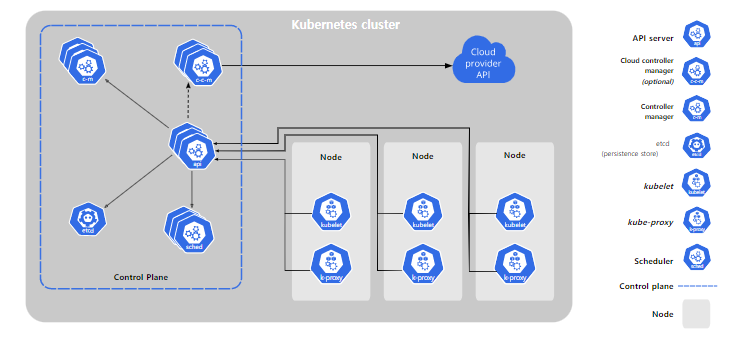

# 쿠버네티스 실습


쿠버네티스 설치에 관한 상세 설명: https://medium.com/finda-tech/overview-8d169b2a54ff

   
* 쿠버네티스에서의 Service => 네트워크 연결(Communication), 서비스    
* container-runtime : docker, rkt, podman, lxc 

## EC2 쿠버네티스 환경 구축
```
master : t3 small 인스턴스 사용(cpu 2, memory 2, 시간당 비용 0.02 달러, 하루 600원)
worker1,2,3: t2micro

# worker 인스턴스 네트워크 설정(NEW VPC A서브넷2, C서브넷1, 같은 보안그룹 사용)
# 보안그룹을 통해 노드들 간의 통신을 설정해주어야 한다. 내부 네트워크의 모든 포트를 개방시켜 통신하는 방식 사용
# 인바운드 그룹 편집 > 유형: 모든 트래픽 > 소스: 사용자 지정 후 자신이 속한 보안그룹을 등록

# worker 인스턴스 3개 생성, master 인스턴스 1개 생성 후 공통 설정 명령어
sudo su - root
curl https://download.docker.com/linux/centos/docker-ce.repo -o /etc/yum.repos.d/docker-ce.repo
sed -i -e "s/enabled=1/enabled=0/g" /etc/yum.repos.d/docker-ce.repo
yum install -y docker
systemctl enable --now docker
systemctl daemon-reload
systemctl restart docker

# AWS linux2는 기본적으로 firewalld가 없고 selinux는 기본값이 disable이다. 
# systemctl disable --now firewalld
# setenforce 0
# sed -i 's/^SELINUX=enforcing$/SELINUX=disabled/' /etc/selinux/config

# 메모리 스왑기능 off
# Pod를 할당하고 제어하는 kubelet은 스왑 상황을 처리하도록 설계되지 않았음.
# 이유는 kubernetes에서 가장 기본이 되는 Pod의 컨셉 자체가 필요한 리소스 만큼만 호스트 자원에서 할당 받아 사용한다는 구조이기 때문이다.
# 따라서 kubernetes 개발팀은 메모리 스왑을 고려하지 않고 설계했기 때문에 클러스터 노드로 사용할 서버 머신들은 모두 스왑 메모리를 비활성화 해줘야 한다.
# 메모리 정보 확인
free -h 
# swap 기능도 기본으로 off
# swapoff -a

# 시스템이 리부트되더라도 스왑기능 off
# sed -i '/ swap / s/^/#/' /etc/fstab


# nftables 백엔드는 현재 kubeadm 패키지와 호환되지 않는다.
# nftables 백엔드를 사용하면 방화벽 규칙이 중복되어 kube-proxy가 중단된다.
cat <<EOF > /etc/sysctl.d/k8s.conf
net.bridge.bridge-nf-call-ip6tables = 1
net.bridge.bridge-nf-call-iptables = 1
EOF
# 커널 매개변수 변경 확인 
sysctl --system

cat <<'EOF' > /etc/yum.repos.d/kubernetes.repo
[kubernetes]
name=Kubernetes
baseurl=https://packages.cloud.google.com/yum/repos/kubernetes-el7-$basearch
enabled=1
gpgcheck=1
repo_gpgcheck=1
gpgkey=https://packages.cloud.google.com/yum/doc/yum-key.gpg https://packages.cloud.google.com/yum/doc/rpm-package-key.gpg
EOF

# Kubernetes Setup
# kubernetes 클러스터 구성을 위해 모든 노드에 아래의 패키지를 설치 해야 한다.
# kubeadm : kubernetes 클러스터를 구축하기 위해 사용하는 툴이다.
# kubelet : 클러스터의 모든 머신에서 실행되며 Pod 및 컨테이너 시작 등의 작업을 수행하는 구성 요소이다.
# kubectl : 클러스터와 통신하는 커맨드라인 인터페이스 유틸이다.
yum -y install kubeadm-1.19.16-0 kubelet-1.19.16-0 kubectl-1.19.16-0 --disableexcludes=kubernetes
systemctl enable kubelet

### master 인스턴스 설정
# --apiserver-advertise-address=master의 private ip
# 완료되면 토큰 정보 생성
kubeadm init --apiserver-advertise-address=10.0.45.58 --pod-network-cidr=10.244.0.0/16 

# 아래 3줄의 명령어는 Root 계정이 아닌 다른 사용자 계정에서 kubectl 커맨드 명령어를 사용하여 클러스터를 제어하기 위해 사용하는 명령어이다.
mkdir -p $HOME/.kube
cp -i /etc/kubernetes/admin.conf $HOME/.kube/config
chown $(id -u):$(id -g) $HOME/.kube/config

kubectl apply -f https://raw.githubusercontent.com/coreos/flannel/master/Documentation/kube-flannel.yml
kubectl get nodes

### worker 인스턴스 설정
kubeadm join 10.0.45.58:6443 --token 어쩌고저쩌고 \
    --discovery-token-ca-cert-hash sha256:어쩌고저쩌고

### master로 와서 확인 및 자동완성 설정
kubectl get nodes
kubectl get pods --all-namespaces
source <(kubectl completion bash)
echo "source <(kubectl completion bash)" >> ~/.bashrc
```

## Kubernetes Pod, Service 활용 

```
# master 인스턴스에서 실습 
mkdir workspace && cd $_
vi nginx-pod.yaml
-------------------------------------------------------
apiVersion: v1 # 순서 외울때 아키메스(akimes)
kind: Pod
metadata:
  name: nginx-pod
  labels:
    app: nginx-pod
spec: # docker run -d -p ?:80 --name nginx-pod-container nginx와 같은 의미
  containers:
  - name: nginx-pod-container # name의 n만 2칸 이상 떨어져있으면 된다.
    image: nginx
    ports:
    - containerPort: 80
--------------------------------------------------------

kubectl apply -f nginx-pod.yaml
kubectl get pod -o wide
kubectl describe pod nginx-pod

### 클러스터 IP ###
vi clusterip-svc.yaml
-------------------------------------------------------
apiVersion: v1
kind: Service
metadata:
  name: clusterip-svc
spec:
  type: ClusterIP
  selector:  # 파드의 라벨(label)
    app: nginx-pod
  ports:
  - protocol: TCP
    port: 80
    targetPort: 80
-------------------------------------------------------

kubectl apply -f clusterip-svc.yaml
kubectl get svc -o wide
-------------------------------------------------------
NAME            TYPE        CLUSTER-IP      EXTERNAL-IP   PORT(S)   AGE   SELECTOR
clusterip-svc   ClusterIP   10.97.233.202   <none>        80/TCP    20s   app=nginx-pod
kubernetes      ClusterIP   10.96.0.1       <none>        443/TCP   53m   <none>
-------------------------------------------------------
# 다른 워커 노드에 있는 nginx pod의 index.html이 출력된다. 
curl 10.97.233.202
kubectl describe svc clusterip-svc

### 노드포트 ###
vi nodeport-svc.yaml
-------------------------------------------------------
apiVersion: v1
kind: Service
metadata:
  name: nodeport-svc
spec:
  type: NodePort
  selector:   # 파드의 라벨(label)
    app: nginx-pod
  ports:
  - protocol: TCP
    port: 80
    targetPort: 80
    nodePort: 30080
-------------------------------------------------------

kubectl get svc -o wide
-------------------------------------------------------
NAME            TYPE        CLUSTER-IP      EXTERNAL-IP   PORT(S)        AGE   SELECTOR
clusterip-svc   ClusterIP   10.97.233.202   <none>        80/TCP         15m   app=nginx-pod
kubernetes      ClusterIP   10.96.0.1       <none>        443/TCP        69m   <none>
nodeport-svc    NodePort    10.109.82.35    <none>        80:30080/TCP   54s   app=nginx-pod
# 주의할 점: 80:30080은 포트포워딩 개념이 아니라 80포트도 있고, 30080 포트도 있다는 것을 뜻한다. 즉, 러스터 IP의 기능과 노드포트의 기능을 동시에 수행하고 있다는 것이다. 외부에서 30080포트로 접속하려면 '보안그룹'을 설정해주어야 한다. 이후 노드들의 모든 퍼블릭IP:30080로 접속이 가능하다.  
-------------------------------------------------------

### 로드밸런서 ###
vi loadbalancer-svc.yaml
-------------------------------------------------------
apiVersion: v1
kind: Service
metadata:
  name: loadbalancer-svc
spec:
  type: LoadBalancer
  # 워커 노드의 Private IP를 사용
  externalIPs:
  - 10.0.2.206
  selector:
    app: nginx-pod
  ports:
  - protocol: TCP
    port: 80
    targetPort: 80
-------------------------------------------------------

kubectl apply -f loadbalancer-svc.yaml
kubectl get svc -o wide
-------------------------------------------------------
NAME               TYPE           CLUSTER-IP      EXTERNAL-IP   PORT(S)        AGE    SELECTOR
clusterip-svc      ClusterIP      10.97.233.202   <none>        80/TCP         124m   app=nginx-pod
kubernetes         ClusterIP      10.96.0.1       <none>        443/TCP        177m   <none>
아래 로드밸런서의 외부 IP로 포트매핑없이 접속가능하다. (클러스터IP + 노드포트 서비스 포함)
loadbalancer-svc   LoadBalancer   10.99.28.232    10.0.2.206    80:32532/TCP   13s    app=nginx-pod
nodeport-svc       NodePort       10.109.82.35    <none>        80:30080/TCP   109m   app=nginx-pod
-------------------------------------------------------

### 다른 이미지로 실습해보기 ### 
cp nginx-pod.yaml my-nginx-pod.yml
vi my-nginx-pod.yml
-------------------------------------------------------
apiVersion: v1 
kind: Pod
metadata:
  name: my-nginx-pod
  labels:
    app: my-nginx-pod
spec:
  containers:
  - name: nginx-pod-container 
    image: 사용자이름/test_build:v1.0
    ports:
    - containerPort: 80
-------------------------------------------------------

cp loadbalancer-svc.yaml my-loadbalancer-svc.yaml
vi my-loadbalancer-svc.yaml

-------------------------------------------------------
apiVersion: v1
kind: Service
metadata:
  name: my-loadbalancer-svc
spec:
  type: LoadBalancer
  externalIPs:
  - 13.124.45.79
  selector:
    app: my-nginx-pod
  ports:
  - protocol: TCP
    port: 80
    targetPort: 80
-------------------------------------------------------

kubectl apply -f my-nginx-pod.yml
kubectl apply -f my-loadbalancer-svc.yaml

# 로드밸런서의 외부 IP로 접속
```

## Oracle + War
```
# DB Server 
docker run -d -p 1521:1521 -e ORACLE_ALLOW_REMOTE=true --name oracledb oracleinanutshell/oracle-xe-11g

# Spring war 이미지 만들기 : Web Server
[root@ip-10-0-2-206 ~]# mkdir test
cd test
cp /home/ec2-user/ROOT.war .

vi Dockerfile.spring
-------------------------------------------------------
FROM tomcat:9
ENV TZ=Asia/Seoul
RUN ln -snf /usr/share/zoneinfo/$TZ /etc/localtime && echo $TZ > /etc/timezone
ADD ROOT.war /usr/local/tomcat/webapps/
EXPOSE 8080
CMD ["catalina.sh", "run"]

docker build -t 사용자이름/spring:v1.0 -f Dockerfile.spring . 
docker run -d -p 8080:8080 --name spring 사용자이름/spring:v1.0
------------------------------------------------------ㅇ
```


## 여기까지  

```
--- Deployment
# vi deployment.yaml
apiVersion: apps/v1
kind: Deployment
metadata:
  name: nginx-deployment
spec:
  replicas: 3
  selector:
    matchLabels:
      app: nginx-deployment
  template:
    metadata:
      name: nginx-deployment
      labels:
        app: nginx-deployment
    spec:
      containers:
      - name: nginx-deployment-container
        image: nginx
        ports:
        - containerPort: 80

# kubectl apply -f deployment.yaml
# kubectl get deployments.apps -o wide
# kubectl describe deployments.apps nginx-deployment

# vi clusterip-deployment.yaml # 클러스터아이피 야믈
apiVersion: v1
kind: Service
metadata:
  name: clusterip-service-deployment
spec:
  type: ClusterIP
  selector:
    app: nginx-deployment
  ports:
  - protocol: TCP
    port: 80
    targetPort: 80

# kubectl apply -f clusterip-deployment.yaml
# kubectl get svc -o wide
# kubectl describe svc clusterip-service-deployment

# vi nodeport-deployment.yaml # 노드포트 야믈
apiVersion: v1
kind: Service
metadata:
  name: nodeport-service-deployment
spec:
  type: NodePort
  selector:
    app: nginx-deployment
  ports:
  - protocol: TCP
    port: 80
    targetPort: 80
    nodePort: 30080

# kubectl apply -f nodeport-deployment.yaml
# kubectl get svc -o wide
# kubectl describe svc nodeport-service-deployment

# vi loadbalancer-deployment.yaml # 로드밸런서 야믈
apiVersion: v1
kind: Service
metadata:
  name: loadbalancer-service-deployment
spec:
  type: LoadBalancer
  externalIPs:
  - 172.16.0.128
  selector:
    app: nginx-deployment
  ports:
  - protocol: TCP
    port: 80
    targetPort: 80
# kubectl apply -f loadbalancer-deployment.yaml
# kubectl get svc -o wide
# kubectl describe svc loadbalancer-service-deployment

# kubectl get all
# kubectl delete pod,svc --all
# kubectl delete replicaset,svc --all
# kubectl delete deployment,svc --all

- Deployment 롤링 업데이트 제어

# kubectl set image deployment.apps/nginx-deployment nginx-deployment-container=nginx:1.9.1
# kubectl get all
# kubectl rollout history deployment nginx-deployment
# kubectl rollout history deployment nginx-deployment --revision=2 # 리비전2 상세보기
# kubectl rollout undo deployment nginx-deployment # 롤백(전 단계로 복원)
# kubectl get all
# kubectl rollout history deployment nginx-deployment
# kubectl rollout history deployment nginx-deployment --revision=3 # 리비전3 상세보기

### Ingress ###

# kubectl apply -f ingress-nginx.yaml

# vi ingress-deploy.yaml
---
apiVersion: apps/v1
kind: Deployment
metadata:
  name: foods-deploy
spec:
  replicas: 1
  selector:
    matchLabels:
      app: foods-deploy
  template:
    metadata:
      labels:
        app: foods-deploy
    spec:
      containers:
      - name: foods-deploy
        image: halilinux/test-home:v1.0
---
apiVersion: v1
kind: Service
metadata:
  name: foods-svc
spec:
  type: ClusterIP
  selector:
    app: foods-deploy
  ports:
  - protocol: TCP
    port: 80
    targetPort: 80
---
apiVersion: apps/v1
kind: Deployment
metadata:
  name: sales-deploy
spec:
  replicas: 1
  selector:
    matchLabels:
      app: sales-deploy
  template:
    metadata:
      labels:
        app: sales-deploy
    spec:
      containers:
      - name: sales-deploy
        image: halilinux/test-home:v2.0
---
apiVersion: v1
kind: Service
metadata:
  name: sales-svc
spec:
  type: ClusterIP
  selector:
    app: sales-deploy
  ports:
  - protocol: TCP
    port: 80
    targetPort: 80
---
apiVersion: apps/v1
kind: Deployment
metadata:
  name: home-deploy
spec:
  replicas: 1
  selector:
    matchLabels:
      app: home-deploy
  template:
    metadata:
      labels:
        app: home-deploy
    spec:
      containers:
      - name: home-deploy
        image: halilinux/test-home:v0.0
---
apiVersion: v1
kind: Service
metadata:
  name: home-svc
spec:
  type: ClusterIP
  selector:
    app: home-deploy
  ports:
  - protocol: TCP
    port: 80
    targetPort: 80

# kubectl get all

# kubectl apply -f ingress-deploy.yaml

# vi ingress-config.yaml
apiVersion: networking.k8s.io/v1beta1
kind: Ingress
metadata:
  name: ingress-nginx
  annotations:
    nginx.ingress.kubernetes.io/rewrite-target: /
spec:
  rules:
  - http:
      paths:
      - path: /foods
        backend:
          serviceName: foods-svc
          servicePort: 80
      - path: /sales
        backend:
          serviceName: sales-svc
          servicePort: 80
      - path:
        backend:
          serviceName: home-svc
          servicePort: 80

# kubectl apply -f ingress-config.yaml

# vi ingress-service.yaml
apiVersion: v1
kind: Service
metadata:
  name: nginx-ingress-controller
  namespace: ingress-nginx
spec:
  ports:
  - name: http
    protocol: TCP
    port: 80
    targetPort: 80
  - name: https
    protocol: TCP
    port: 443
    targetPort: 443
  selector:
    app.kubernetes.io/name: ingress-nginx
  type: LoadBalancer
  externalIPs:
  - 172.16.0.128

# kubectl apply -f ingress-service.yaml

### volume
# vi pv-hostpath-label.yaml
apiVersion: v1
kind: PersistentVolume
metadata:
  name: pv-hostpath-label
  labels:
    location: local
spec:
  capacity:
    storage: 2Gi
  volumeMode: Filesystem
  accessModes:
  - ReadWriteOnce
  storageClassName: manual
  persistentVolumeReclaimPolicy: Delete
  hostPath:
    path: /tmp/k8s-pv

# kubectl apply -f pv-hostpath-label.yaml

# vi pvc-hostpath-label.yaml
kind: PersistentVolumeClaim
apiVersion: v1
metadata:
  name: pvc-hostpath-label
spec:
  accessModes:
  - ReadWriteOnce
  volumeMode: Filesystem
  resources:
    requests:
      storage: 1Gi
  storageClassName: manual
  selector:
    matchLabels:
      location: local

# kubectl apply -f pvc-hostpath-label.yaml

# vi deployment-pvc.yaml
apiVersion: apps/v1
kind: Deployment
metadata:
  name: kubernetes-simple-app
  labels:
    app: kubernetes-simple-app
spec:
  replicas: 1
  selector:
    matchLabels:
      app: kubernetes-simple-app
  template:
    metadata:
      labels:
        app: kubernetes-simple-app
    spec:
      containers:
      - name: kubernetes-simple-app
        image: nginx
        ports:
        - containerPort: 80
        imagePullPolicy: Always
        volumeMounts:
        - mountPath: "/usr/share/nginx/html"
          name: myvolume
      volumes:
      - name: myvolume
        persistentVolumeClaim:
          claimName: pvc-hostpath-label

### configMap
# vi configmap-wordpress.yaml
apiVersion: v1
kind: ConfigMap
metadata:
  name: config-wordpress
  namespace: default
data:
  MYSQL_ROOT_HOST: '%'
  MYSQL_ROOT_PASSWORD: test1234
  MYSQL_DATABASE: wordpress
  MYSQL_USER: wpuser
  MYSQL_PASSWORD: wppass

# kubectl apply -f configmap-wordpress.yaml

# kubectl describe configmaps config-wordpress

# vi mysql-pod-svc.yaml
apiVersion: v1
kind: Pod
metadata:
  name: mysql-pod
  labels:
    app: mysql-pod
spec:
  containers:
  - name: mysql-container
    image: mysql:5.7.22
    envFrom:
    - configMapRef:
        name: config-wordpress
    ports:
    - containerPort: 3306
---
apiVersion: v1
kind: Service
metadata:
  name: mysql-svc
spec:
  type: ClusterIP
  selector:
    app: mysql-pod
  ports:
  - protocol: TCP
    port: 3306
    targetPort: 3306

# kubectl apply -f mysql-pod-svc.yaml

# vi wordpress-pod-svc.yaml
apiVersion: v1
kind: Pod
metadata:
  name: wordpress-pod
  labels:
    app: wordpress-pod
spec:
  containers:
  - name: wordpress-container
    image: wordpress:4.8.2
    env:
    - name: WORDPRESS_DB_HOST
      value: mysql-svc:3306
    - name: WORDPRESS_DB_USER
      valueFrom:
        configMapKeyRef:
          name: config-wordpress
          key: MYSQL_USER
    - name: WORDPRESS_DB_PASSWORD
      valueFrom:
        configMapKeyRef:
          name: config-wordpress
          key: MYSQL_PASSWORD
    - name: WORDPRESS_DB_NAME
      valueFrom:
        configMapKeyRef:
          name: config-wordpress
          key: MYSQL_DATABASE
    ports:
    - containerPort: 80
---
apiVersion: v1
kind: Service
metadata:
  name: wordpress-svc
spec:
  type: LoadBalancer
  externalIPs:
  - 172.16.0.128
  selector:
    app: wordpress-pod
  ports:
  - protocol: TCP
    port: 88
    targetPort: 80

# kubectl apply -f wordpress-pod-svc.yaml

### namespace
# vi namespace-app.yml
apiVersion: v1
kind: Namespace
metadata:
  name: app

# kubectl apply -f namespace-app.yml

# vi namespace-order.yml
apiVersion: v1
kind: Namespace
metadata:
  name: order

# kubectl apply -f namespace-order.yml

### ResourceQuota
# vi sample-resourcequota.yaml
apiVersion: v1
kind: ResourceQuota
metadata:
  name: sample-resourcequota
  namespace: app
spec:
  hard:
    count/pods: 3

# kubectl describe resourcequotas sample-resourcequota
# kubectl run pod new-nginx1 -n app --image=nginx

### LimitRange
# vi sample-limitrange-container.yaml
apiVersion: v1
kind: LimitRange
metadata:
  name: sample-limitrange-container
spec:
  limits:
  - type: Container
    default:
      memory: 512Mi
      cpu: 500m
    defaultRequest:
      memory: 256Mi
      cpu: 250m
    max:
      memory: 1024Mi
      cpu: 1000m
    min:
      memory: 128Mi
      cpu: 125m
    maxLimitRequestRatio:
      memory: 2
      cpu: 2

# vi sample-pod.yaml
apiVersion: v1
kind: Pod
metadata:
  name: sample-pod
spec:
  containers:
  - name: nginx-container
    image: nginx:1.16

# vi sample-pod-overrequest.yaml
apiVersion: v1
kind: Pod
metadata:
  name: sample-pod-overrequest
spec:
  containers:
  - name: nginx-container
    image: nginx:1.16
    resources:
      requests:
        cpu: 100m
      limits:
        cpu: 100m

# vi sample-pod-overratio.yaml
apiVersion: v1
kind: Pod
metadata:
  name: sample-pod-overratio
spec:
  containers:
  - name: nginx-container
    image: nginx:1.16
    resources:
      requests:
        cpu: 250m
      limits:
        cpu: 500m

### EKS

$ aws configure
$ aws eks --region ap-northeast-2 update-kubeconfig --name EKS-CLUSTER
$ curl -o kubectl https://amazon-eks.s3-us-west-2.amazonaws.com/1.21.2/2021-07-05/bin/linux/amd64/kubectl
$ chmod +x ./kubectl
$ sudo mv ./kubectl /usr/local/bin
$ source <(kubectl completion bash)
$ echo "source <(kubectl completion bash)" >> ~/.bashrc
$ kubectl version --short --client
$ kubectl get svc

- nodegroup 역할 만들기
AmazonEKSWorkerNodePolicy
AmazonEC2ContainerRegistryReadOnly
AmazonEKS_CNI_Policy

$ mkdir work && cd $_
$ vi deployment.yaml
apiVersion: apps/v1
kind: Deployment
metadata:
  name: web-site-deployment
spec:
  replicas: 4
  selector:
    matchLabels:
      app: web-site-deployment
  template:
    metadata:
      name: web-site-deployment
      labels:
        app: web-site-deployment
    spec:
      containers:
      - name: web-site-deployment-container
        image: public.ecr.aws/r5a6z4q5/web-site:v1.0

---

$ vi loadbalancer-deployment.yaml
apiVersion: v1
kind: Service
metadata:
  name: loadbalancer-service-deployment
spec:
  type: LoadBalancer
  selector:
    app: web-site-deployment
  ports:
  - protocol: TCP
    port: 80
    targetPort: 80
```

