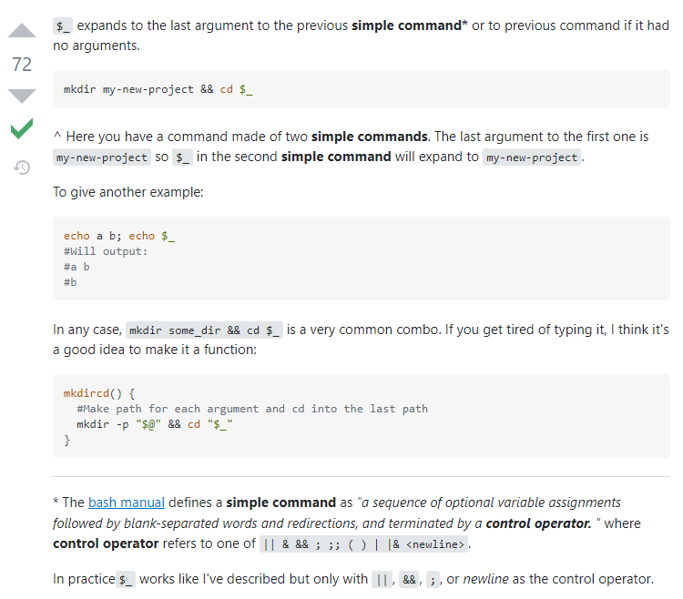

## 한 번이라도 썼던 명령어 기록용

* readlink: 심볼릭 파일의 경로를 읽는다.    
    -f 옵션: 재귀적으로 파일의 경로를 찾아 들어가서 실제 파일의 경로를 찾는다

* source: 스크립트 파일을 수정한 후에 수정된 값을 바로 적용한다. 

* scp [옵션] [Source 경로] [Target 경로]

    Usage : scp [옵션] [Source 경로] [Target 경로]
    로컬 -> 원격지      
    scp 전송할파일 유저명@네트워크주소(IP주소):목적지경로  
    원격지 -> 로컬  
    scp 유저명@네트워크주소(IP주소):전송할파일 목적지경로  
    원격지 -> 원격지   
    scp 유저명@네트워크주소(IP주소):전송할파일  
    유저명@네트워크주소:목적지경로     

    옵션

    -r : 재귀적으로 폴더의 모든 내용을 복사, 폴더를 복사할 때 사용하는 옵션  
    -P : ssh 포트를 지정하는 옵션  
    -i : ssh 키파일과 같은 identity file의 경로를 지정하는 옵션  
    -v : verbose 모드로 상세내용을 보며 디버깅을 할 때 사용  
    -p : 파일의 수정 시간과 권한 유지  

* wget: 웹 상의 파일을 다운로드 받을 때 사용

    `wget [옵션]... [URL]...`

    옵션

    -O filename DOWNLOAD-URL : wget을 통해 다운로드 할 경우 저장되는 파일명은 기본적으로 URL의 마지막 '/' 뒤에 오는 단어를 파일명으로 저장한다. -O 옵션을 사용하면 파일 이름을 지정할 수 있다.   
    
* sed: Stream Editor의 약자로 원본 텍스트 파일을 편집하는 명령어. 원본을 건드리지 않고 편집을 해서 작업이 완료되도 원본에는 영향이 없다. 대신 -i 옵션을 사용하면 원본을 바꾸게 된다. 

* `echo HOME`     
    `HOME`  
  `echo $HOME` 또는 `echo ${HOME}`     
    `/home/username`
  
  달러 기호, 달러기호{}는 변수 이름이 아니라 변수의 값을 쉘에 전달한다.   
  `&()`는 괄호안 명령어를 실행한 결과 값을 쉘에 전달한다.       
  `echo $(uname -s)`     
    `Linux`     
  `echo $(uname -m)`      
    `x86_64)`       
  * $_ 의미 

* whereis는 명령어의 실행파일위치, 소스위치, man페이지파일의 위치를 찾아주는 명령어이다. 명령어의 위치만을 찾아주는 which에 비해 명령어와 관련된 파일들을 모두 찾아주므로 보다 포괄적인 명령어위치 탐색명령어이다.  
    * 형식 : `whereis [명령어] 또는 whereis [파일이름]`
    * 주요 옵션
      * 
        -b : 해당 명령어의 실행파일 위치만을 검색함  
        -m : 해당 명령어의 메뉴얼페이지 위치만을 검색함  
        -s : 해당 명령어에 관한 소스위치만을 검색함  

 * 설정하고자하는 변수를 환경변수로 등록할 때 사용   
    `export PATH=/추가할 경로1:/추가할 경로2:/경로3:$PATH`  
    * 기존의 $PATH값은 $PATH를 붙여줌으로써 유지해줍니다. 만약 이 $PATH가 붙지 않는다면 기존 $PATH값이 유지되지 않는다.
    * 위 명령어는 일시적용이다. 현재 사용자가 영구적으로 적용하려면 ~/.bash_profile. 전체 사용자가 영구적으로 사용하려면 /etc/bash.bashrc나 /etc/profile 하단에 추가해야된다.

* sh -c는 shell을 실행하고 -c 옵션이 있으면 문자열 에서 명령을 읽는다. 
