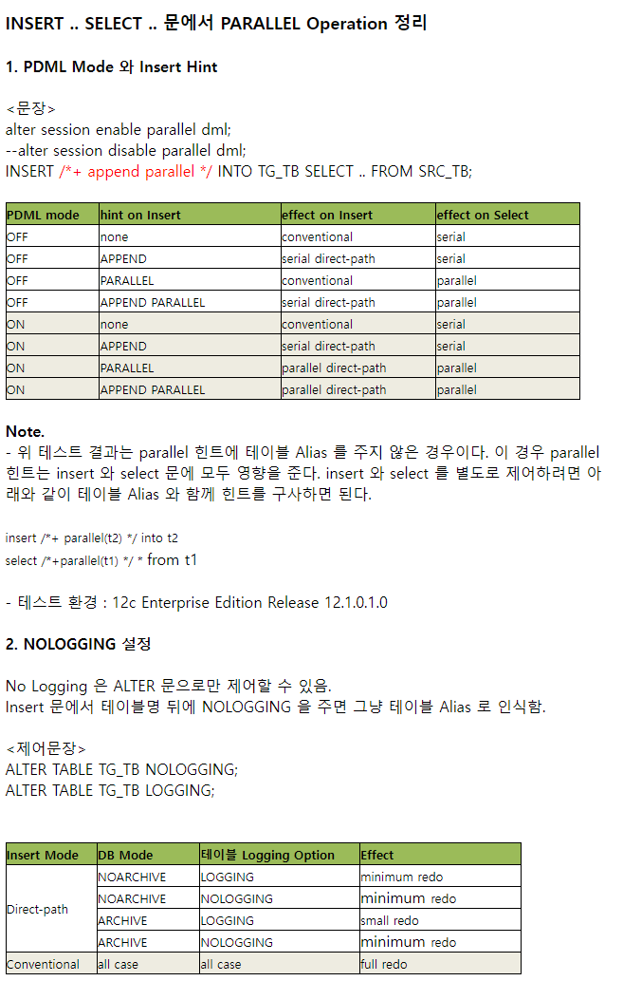

# 데이터베이스 튜닝 정리

[파티션 인덱스](#파티션-인덱스)

[증분 쿼리](#증분-쿼리)

[랜덤 액세스 종류](#랜덤-액세스-종류)

[스칼라 서브쿼리 캐싱 효과](#스칼라-서브쿼리-캐싱-효과)

[PARALLEL 힌트 우선순위](#parallel-힌트-우선순위)

[힌트가 무시되는 경우](#힌트가-무시되는-경우)

[힌트 조인순서](#힌트-조인순서)

[바인드 변수와 실행계획](#바인드-변수와-실행계획)

[병렬로 해시 조인할 때 TEMP TABLESPACE를 많이 썼던 이유](#병렬로-해시-조인할-때-temp-tablespace를-많이-썼던-이유)

[인덱스와 NL JOIN](#인덱스와-nl-join)

[DBMS_XPLAN.DISPLAY_CURSOR 결과 보는 법](https://theone79.tistory.com/m/865)

[DBMS_XPLAN.DISPLAY_CURSOR 사용시 직전 SQL_ID를 못찾는 이유](#dbms_xplandisplay_cursor-사용시-직전-sql_id를-못찾는-이유)

[HASH GROUP BY vs. SORT GROUP BY(GROUP BY가 더이상 정렬된 결과를 보장하지 않는 이유)](https://dataonair.or.kr/db-tech-reference/d-story/data-story/?mod=document&uid=63006)

[INSERT시 append와 parallel 힌트](#insert시-append와-parallel-힌트)

[INSERT구문에서 parallel 사용할 때 유의할 점](#insert구문에서-parallel-사용할-때-유의할-점)

[시스템 카탈로그 뷰 (sys 관련 뷰)에 parallel 힌트](#시스템-카탈로그-뷰-sys-관련-뷰에-parallel-힌트)

[driving 테이블이 0건이어도 수행시간이 오래걸렸던 이유](#driving-테이블이-0건이어도-수행시간이-오래걸렸던-이유)

[옵티마이저의 쿼리변환 사례](#옵티마이저의-쿼리변환-사례)

## 파티션 인덱스


## 증분 쿼리
```
1) OUTER JOIN방식
SELECT A.*
FROM A, B
WHERE A.KEY = B.KEY(+)
AND B.KEY IS NULL;

2) NOT IN (대용량에 부적합)
SELECT A.* 
FROM A, B
WHERE A.KEY = B.KEY(+)
AND NVL(B.STATUS, 'W') NOT IN ('S','F');

3) NOT EXISTS
SELECT *
FROM A
WHERE NOT EXISTS (SELECT *
                    FROM B
                    WHERE A.KEY = B.KEY);

튜닝 원칙
- 데이터 제한 조건은 인덱스를 사용
- 데이터 불러오는 양을 적게할수록 좋음
- 사용자 함수는 자제 ---> http://www.gurubee.net/article/14081 사용자 함수의 튜닝방법
- FULLTABLESCAN이 나쁜것만은 아니다(왜?)
- NOT IN 보다는 IN 사용 권장
- NOT EXISTS 보다는 EXISTS 사용 권장
- UNION 보다는 UNION ALL 사용 권장 
```

## 랜덤 액세스 종류
- 확인 랜덤 액세스: WHERE 조건의 컬럼이 인덱스에 존재하지 않아 테이블을 액세스 
- 추출 랜덤 액세스: SELECT 절의 컬럼이 인덱스에 없어 테이블을 액세스
- 정렬 랜덤 액세스: ORDER BY 절 등에 사용된 컬럼이 인덱스에 존재하지 않아 테이블을 액세스하여 정렬을 수행하기 위해 데이터를 액세스 
- 확인 랜덤 액세스가 랜덤 액세스 중 가장 많을 부하를 발생시키며 이를 최우선적으로 제거하기 위해 노력해야 한다. 


## 스칼라 서브쿼리 캐싱 효과
- 오라클은 스칼라 서브쿼리의 입력 값과 출력 값을 내부 캐시(QUERY EXECUTION CACHE)에 저장
- 스칼라 서브쿼리가 수행될 때 일단 입력 값을 캐시에서 찾아보고 있으면 저장된 출력 값을 리턴
- 캐시에서 찾지 못할 경우 쿼리 수행, 결과 값은 캐시에 저장
```
-- 반복수행되는 함수 때문에 쿼리 성능이 크게 저하될 경우 스칼라 서브쿼리를 이용하여 튜닝
-- 그냥 함수 호출 -> 캐싱X VS 서브쿼리로 호출 -> 캐싱O 
SELECT EMPNO, ENAME, SAL, HIREDATE
    , (SELECT GET_DATE(DEPTNO) FROM DUAL) DNAME
FROM EMP E
WHERE SAL >= 2000;
```
- 스칼라 서브쿼리의 캐싱 효과는 입력 값의 종류가 소수여서 해시 충돌 가능성이 적을 때 큼
- 입력 값의 종류가 많으면 캐시를 확인하는 비용 때문에 오히려 성능은 저하되고 CPU 사용률만 높아짐 -------> 입력 값이 많으면 캐시에 없을 확률이 높아지고, 그냥 쿼리를 실행시키면 될 걸 굳이 캐시를 뒤지는 시간까지 포함이 되어 쿼리를 수행하기 때문에 효율이 저하된다.

## PARALLEL 힌트 우선순위
```
SELECT /*+ PARALLEL(24) */ *
  FROM TABLE A  -----> 24개 프로세스 병렬수행

SELECT /*+ PARALLEL(24) */ *
  FROM TABLE A, TABLE B  
  WHERE A.COL1 = B.COL1 -----> 48개 프로세스 병렬수행

SELECT /*+ PARALLEL(24) */ *
 FROM TABLE A
    , (SELECT /*+PARALLEL(48)*/ *
         FROM TABLE B)
 WHERE A.COL1 = B.COL1 ------> 24개 프로세스 병렬수행(메인쿼리 설정을 따라감)
```

## 힌트가 무시되는 경우 
1. 문법적으로 맞지 않게 힌트를 기술
2. 잘못된 참조 사용: 없는 테이블 별칭을 사용한 경우, 없는 인덱스 명을 지정한 경우 등 
3. 논리적으로 불가능한 엑세스 경로 
    - 조인절에 등치 조건이 하나도 없는데 해시 조인으로 유도
    - 테이블 전체 건수를 COUNT하는 쿼리에 NULL을 허용하는 단일 컬럼으로 생성한 인덱스를 사용하도록 힌트를 기술한 경우
4. 의미적으로 맞지 않게 기술: 예를 들어, 서브쿼리에 UNNEST와 PUSH_SUBQ를 같이 기술한 경우
5. <U>옵티마이저에 의해 내부적으로 쿼리가 변환된 경우</U>
6. 버그 

## 힌트 조인순서 
```
SELECT /*+ LEADING(C A D B) USE_NL(A) USE_NL(D) USE_HASH(B) */
=> C,A,D,B 순으로 A와 D를 조인할 때는 NL조인으로, B와 조인할 때는 HASH조인으로
SELECT /*+ USE_NL(A B C D) */ 
=> A,B,C,D를 조인할 때 모두 NL조인으로 하고, 조인순서는 옵티마이저에게 맡김
```

## 바인드 변수와 실행계획 
-> 바인드 변수를 사용하면 통계 정보를 제대로 이요하지 못해 악성 실행 계획을 수립하는 경우가 발생한다. 나 같은 경우 INSERT-SELECT 쿼리를 직접 서버에 날리면 문제가 없는데, 바인드 변수를 받는 SP를 사용할 때 급격하게 느려지는 경우가 있었다. SP 내에서 바인드 변수 대신 리터럴 변수를 사용하거나, 힌트를 정확히 명시했을 때 해결되는 것을 보면 옵티마이저가 악성 실행 계획을 세운 것이라 추측이 된다. 
http://wiki.gurubee.net/pages/viewpage.action?pageId=26741319

## 병렬로 해시 조인할 때 TEMP TABLESPACE를 많이 썼던 이유
우선 해시 조인 원리: http://wiki.gurubee.net/pages/viewpage.action?pageId=26740416

요약: 여러 테이블을 해시 조인할 때, 1) BUILD INPUT은 조인에 성공한 결과를 해시테이블로 빌드하거나, 2) 각각의 테이블을 해시테이블로 만들고 탐색하는 알고리즘을 사용한다. 그리고 BUILD INPUT이 HASH AREA를 초과할 때는 해시 함수로 파티션된 집합을 TEMP에 저장하고(파티션 단계), 파티션 짝별로 작은쪽이 해시테이블을 생성 후 반대편 파티션로우를 하나씩 읽으면서 해시테이블을 탐색한다. 파티션 단계에서 양쪽 집합을 모두 읽어 디스크 상의 TEMP 공간에 일단 저장해야 하므로 IN-MEMORY 해시 조인보다 성능이 크게 떨어진다.

그렇다면 병렬로 했을 때 왜그리도 많은 TEMP 용량을 차지하고 있었을까 ..?
단순히 용량이 큰 테이블을 정렬작업 하고 해시 조인을 했기 때문이라고 생각했었다. 하지만 조인에 참여하는 테이블 용량을 다합해도 50G 이하였고, 실제로 TEMP TABLESPACE는 1TB를 넘어가는 것이었다.

그렇게 이유를 찾아보던 도중, 병렬 배포 방법이 PX SEND HASH가 아니라 PX SEND BROADCAST로 PARALLAL DEGREE 수만큼 슬레이브에 복제를 시켜서 그렇다는 글을 발견하였다. 특히 통계 정보가 없는 상태에서 병렬 조인하면 옵티마이저가 아주 큰 테이블을 Broadcast 하는 경우가 종종 생긴다고 한다. 이런 경우 PQ_DISTRIBUTE 힌트를 사용해주어야 한다.


> 참고: https://hourim.wordpress.com/2015/02/24/parallel-query-broadcast-distribution-and-temp-space/

> 참고: http://wiki.gurubee.net/pages/viewpage.action?pageId=6260556

그런데 실제로 실행계획을 조회해 본 결과, PX SEND HASH를 하여 병렬 프로세스 간에 통신하고 있었다... 다시 원점으로 돌아와서... 쿼리문을 실행시키고 SQL MONITORING을 하던 도중 ROWS가 비정상적으로 많은 것을 발견했다. 데이터가 이렇게나 뻥튀기 되고 있을리가 없다는 생각에 조인 조건들을 살펴봤다. A라는 테이블에 B,C,D가 조인하는데, 이 A라는 테이블은 B,C,D가 서로 조인해서 만들어진 키맵 테이블이었다. 
```
CREATE TABLE MASTER_TABLE AS
SELECT A.COL1   A_COL1
     , A.COL2   A_COL2
     , A.COL3   A_COL3
     , B.COL1   B_COL1
     , B.COL2   B_COL2
     , C.COL1   C_COL1
FROM SUB_TABLE1 A
   , SUB_TABLE2 B
   , SUB_TABLE3 C
WHERE A.COL1 = B.COL1
  AND A.COL2 = B.COL2
  AND A.COL3 = B.COL3
  AND B.COL1 = C.COL1

SELECT COUNT(*)
  FROM MASTER_TABLE A
     , SUB_TABLE1 B 
     , SUB_TABLE2 C
     , SUB_TABLE3 D
   AND A.A_COL1 = B.COL1
   AND A.A_COL2 = B.COL2
   AND A.A_COL3 = C.COL3
   AND A.C_COL1 = D.COL1
   ---------------------
   AND B.COL1 = C.COL1
   AND B.COL2 = C.COL2
   AND B.COL3 = C.COL3
   AND C.COL1 = D.COL1
```
점선 아래 조건이 MASTER_TABLE이 만들어졌을 때와 같은 조건이기 때문에 점선 위의 조인 조건으로 조인했을 때 막연하게 1:1의 결과를 가져올거라고 착각했다. <U>조인은 테이블1과 테이블2가 조인이 되고 난 다음, 그 결과를 다음 테이블과 조인하는 것이라는 것을 망각해버린 것이다.</U> 같은 스키마에서 똑같은 쿼리를 수행했는데 처음에는 1초 걸리고 곧바로 돌리면 1시간이 걸리고... 또 다시 돌리면 1초가 걸리는 상황이었다. 일단 쿼리를 수행했던 오라클 환경이 통계 정보를 생성하지 않았기에 매번 실행계획도 달라진 것도 있으리라 추측된다. 또 운 좋게 B,C,D,A 순으로 또는 덜 운이 좋게 A,B,C,D 순서로 조인하도록 계획이 잡히면 빠르게 끝나지만, 혹여 A,D .. 순서로 계획을 생성하는 순간 몇 시간이 걸려버리는 쿼리로 바뀌어버린다.

 예를 들면 만약 D.COL1이 코드컬럼으로 '0', '1', '2' 값이 각각 100만개 씩 존재한다면, A.C_COL1 = D.COL1 조건으로 조인을 하는 순간 A 테이블의 C_COL1 값이 '0', '1', '2'인 로우가 100만개라면 1조 건의 데이터가 생성되어버리는 것이다... 그렇게 실행 계획을 생성해버렸기 때문에 TEMP TABLESPACE가 기하급수적으로 사용되어 버렸던 것이다. 

 ``` 
SELECT COUNT(*)
  FROM MASTER_TABLE A
     ,(SELECT B.COL1, B.COL2, C.COL3, D.COL1 
         FROM SUB_TABLE1 B 
            , SUB_TABLE2 C
            , SUB_TABLE3 D
        WHERE B.COL1 = C.COL1
          AND B.COL2 = C.COL2
          AND B.COL3 = C.COL3
          AND C.COL1 = D.COL1
       ) B 
  WHERE A.A_COL1 = B.COL1
    AND A.A_COL2 = B.COL2
    AND A.A_COL3 = B.COL3
    AND A.C_COL1 = B.COL1
   
```
위와 같이 인라인뷰로 묶어서 사용하면 문제없이 실행될 것이라 생각할 수도 있다. 하지만 9i 부터 인라인뷰를 MERGING 하려고 하기 때문에, (B,C,D)가 순서대로 조인한 다음에 MASTER_TABLE과 조인하리라는 보장은 없다. 인라인뷰가 풀려버려서 A,B,C,D 순으로 조인하기 때문이다. 이를 방지하기 위해 NO_MERGE 힌트를 명시해서 인라인뷰 안에서 우선 조인이 이루어지도록 해야한다. 

우선적으로 A, B, C, D끼리의 테이블 간의 관계, 만약 관계가 없는 테이블끼리 조인한다면 테이블 간 컬럼의 성격이나 데이터 분포를 꼭 알아야만 쿼리를 제대로 만들 수 있을 것일텐데... 데이터 이관업무를 하다보니 가끔 테이블 간의 관계가 논리적으로만 연결이 되고 PK-FK끼리 조인하지 않는 경우가 종종 있다. 이런 경우에 발생하는 문제가 좀 더 캐치하기 어려운 것 같다... 내공을 쌓자!

## 인덱스와 NL JOIN
데이터 이관 중 다른 스키마들에서는 1초 걸리는 쿼리가 특정 스키마에서 몇 시간이 걸리는 상황이 발생했다. 원인은 INDEX와 USE_NL 힌트로 NL 조인을 하라고 명시했는데, 대상 테이블에 인덱스가 생성이 안되어 있었다. 실행계획을 보니 천만 건 정도 되는 테이블을 인덱스가 없으니 FULL SCAN 하였는데, USE_NL 힌트로 인해 NL 조인을 하도록 되어있었다. 인덱스가 없기 때문에 옵티마이저가 USE_NL 힌트를 명시했어도 무시했을 것이라고 생각했는데 아니었다. 힌트를 USE_HASH로 바꿔주니 문제가 해결됨.. 인덱스가 없어도 NL JOIN을 강요하면 NL JOIN을 한다는 것을 배웠다. 

## DBMS_XPLAN.DISPLAY_CURSOR 사용시 직전 SQL_ID를 못찾는 이유
http://www.gurubee.net/article/23992

위와 같은 해결방법을 통해 원인을 유추하자면, dbeaver, SQL Plus, plsql developer 등 사용자에게 어떠한 결과를 보여주기 위해 후처리 작업이 생기는 경우, 후처리 작업 쿼리의 실행계획을 가져오는 경우가 있다. 이처럼 각 프레임워크에서 사용자에게 결과를 보여주기 위해 발생시키는 후처리 쿼리들로 인해 뭔가 꼬임이 발생하는 것 같다.

## INSERT시 append와 parallel 힌트

1. 오라클 append 힌트: https://www.jigi.net/db/4622/ 

2. insert 구문에서 parallel 힌트 위치에 따른 의미차이 with chatGPT
```
나
insert /*+parallel(8)*/ into table_1
select /*+parallel(8)*/ * from table_2 
위 쿼리에서 insert할 때의 병렬수행과 select할 때의 병렬수행은 서로 다른거야?

GPT
네, 맞습니다. insert 문과 select 문에 적용되는 parallel 힌트는 각각 별개이므로 서로 다른 병렬 처리 수준을 설정할 수 있습니다. 예를 들어, insert 문에는 parallel(8) 힌트를 적용하고, select 문에는 parallel(4) 힌트를 적용할 수도 있습니다. 이렇게 서로 다른 병렬 처리 수준을 설정하는 것은 시스템 리소스 사용을 더욱 효율적으로 관리할 수 있도록 도와줍니다.

나
insert into table_1
select /*+parallel(8)*/ * from table_2 
위 쿼리에서 insert 를 병렬처리 하지 않으면 병목이 일어날 수도 있지 않아?

GPT
예, insert into table_1 select /*+parallel(8)*/ * from table_2 쿼리에서 insert 작업을 병렬 처리하지 않을 경우, select 작업과 insert 작업의 속도 차이로 인해 병목 현상이 발생할 가능성이 있습니다. 그렇다면 insert 작업도 병렬 처리를 하면 select 작업과의 속도 차이를 최소화할 수 있으므로, 성능 향상을 기대할 수 있습니다. 하지만 모든 경우에 병렬 처리가 항상 성능 향상을 가져다주는 것은 아니므로, 상황에 따라 적절한 조치를 취해야 합니다.
```

## INSERT구문에서 parallel 사용할 때 유의할 점
1. ALTER SESSION ENABLE PARALLEL DML 또는 힌트절에 ENABLE_PARALLEL_DML를 적용해야 DML시 병렬처리가 된다.
2. 하나의 DML문이 끝날 때마다 COMMIT문을 실행해야 한다. 만약 그렇지 않으면 “ORA-12838: 병렬로 수정한 후 객체를 읽거나 수정할 수 없습니다” 라는 오류가 발생한다.
3. 병렬로 처리하는 DML문 중에 SELECT문이 포함되어 있으면(INSERT ~ SELECT, MERGE문의 USING 절에 SELECT 문이 있을 때 서브 쿼리가 포함된 때 등) SELECT문에 PARALLEL 힌트를 같이 주는 것이 좋다. SELECT는 단일 프로세스가 처리하고 INSERT는 여러 개의 프로세스가 처리하면 생각만큼 성능이 향상되지 않는다.
4. 표에 깔끔하게 정리되어 있다. 
   - 주의할 점1) INSERT에 PARALLEL 힌트를 적용하면, PARALLEL DML이 활성화 되어있지 않더라도 SELECT절에 영향을 준다.
   - 주의할 점2) INSERT 절에서 ALIAS를 사용하면 INSERT절만 영향을 주고, SELECT절은 별도로 PARALLEL 힌트를 적용해야 한다.  

   

  출처: https://m.blog.naver.com/inhim/220187506059


## 시스템 카탈로그 뷰 (sys 관련 뷰)에 parallel 힌트

일반적으로 오라클에서는 시스템 카탈로그 뷰 (sys 관련 뷰)에 parallel 힌트를 사용해도 무시됩니다. 시스템 카탈로그 뷰는 데이터베이스 메타데이터를 조회하는 뷰로, 데이터베이스 내부에서 관리되는 정보를 제공합니다. 이러한 뷰들은 일반적으로 쿼리 실행 계획을 변경하는 힌트를 무시하고 자체적인 실행 방법을 갖고 있습니다.

parallel 힌트는 대부분 데이터베이스 테이블이나 인덱스와 같은 물리적 객체를 대상으로 적용됩니다. 이는 데이터 액세스 및 처리를 병렬로 실행하기 위한 것입니다. 반면 시스템 카탈로그 뷰는 데이터베이스 내부적인 정보를 제공하기 위한 용도로 사용되므로, 병렬 실행에 대한 옵션을 갖고 있지 않습니다.

따라서, sys 관련 뷰에 parallel 힌트를 적용해도 해당 힌트는 무시되며, 시스템 카탈로그 뷰의 실행 계획은 데이터베이스 자체의 로직에 따라 결정됩니다.

## driving 테이블이 0건이어도 수행시간이 오래걸렸던 이유
driving 테이블이 0건이라도 driven 테이블에 "인덱스가 없으면" full scan하게 된다!

## 옵티마이저의 쿼리변환 사례
1. 1억 로우를 가진 테이블 A를 여러번 해시 조인해서 읽어야 하는 상황일 때, 한 번으로 줄일 수 있다면 그렇게 한다.  
  - inner join을 여러번 하지만 join 조건이 같으면 한번만 읽는다.   
  - outer join은 join 조건이 다르더라도 한 번만 읽는다. 
2. 조인 조건 누락으로 인해 터무니 없는 카디널리티 계산되면 해당 테이블을 아예 빼고 쿼리 결과를 도출했음.
3. BETWEEN '2023' AND '2023' 조건은 = 2023 과 차이가 없다 
4. /*+ NO_QUERY_TRANSFORMATION */ 힌트를 통해 view merging, subquery unnesting, push prdeicate 등에 의한 쿼리 변형이 발생하지 않도록 할 수 있다. 
5. ``` 
    SELECT COUNT(*)
    FROM 
      (SELECT ROWNUM RN, A.* FROM TABLE1 A) A
    , (SELECT ROWNUM RN, B.* FROM TABLE2 B) B
    WHERE A.RN = B.RN;  

    각 테이블에 1000만건, 1000만건 있을 때 오라클은 인라인뷰를 버퍼하여 해시조인을 하는데 
    티베로에서는 해시조인 힌트를 줘도 NL조인으로 계속 풀렸다. 고수석님은 티베로는 최대한 인라인뷰로 풀려는 작동방식 때문에, 가이드 주신대로 UNION ALL 구문을 이용해서 티베로가 강제로 버퍼에 올려서 사용하도록 하니 해시조인으로 실행하게 되었다. 

    SELECT COUNT(*)
    FROM 
    (SELECT ROWNUM RN, A.* FROM TABLE1 A 
      UNION ALL 
      SELECT ROWNUM RN, A.* FROM TABLE1 A WHERE 1 = 2
    ) A 
    , (SELECT ROWNUM RN, B.* FROM TABLE2 B
      UINON ALL
      SELECT ROWNUM RN, B.* FROM TABLE2 B WHERE 1 = 2
    ) B 
    WHERE A.RN = B.RN;  
    ```
6. 옵티마이저가 같은 쿼리라도 통계정보나 바인드 변수에 어떤 값이 들어왔는지에 따라 다른 실행계획으로 풀림. 실제 겪었던 상황인데 티베로에 4개의 컬럼으로 이루어진 index가 있었다.이 때 같은 index range scan을 하더라도 통계정보나 바인드 변수에 따라 어떤 경우에는 3번째 컬럼까지 range scan하고, 다른 경우에는 2번째 컬럼까지 range scan 하고 3번째 컬럼을 filter 조건으로 사용하는 경우가 발생했다. 티베로에서 필터조건에서 사용된 3번째 컬럼은 묵시적 형변환(where char컬럼 = (char) 숫자)이 발생했는데, 인덱스 스캔 조건에서는 묵시적 형변환이 발생하지 않아 타입캐스팅 관련 오류가 발생했다. 같은 쿼리라도 실행플랜에 따라 오류를 발생시키거나 정상 수행된다.

7. SELECT 
  ROW_NUMBER() OVER (PARTITION BY COL1, COL2, COL3 ORDER BY COL4) 
,  SUM(COL4) OVER (PARTITION BY COL1, COL2, COL3 ORDER BY COL4) 
,  MAX(COL4) OVER (PARTITION BY COL1, COL2, COL3 ORDER BY COL4) 
, ROW_NUMBER() OVER (PARTITION BY COL1, COL2 ORDER BY COL3)
FROM TAB1;  

위에서 partition by 구문이 여러번 등장한다. 서로 다른 윈도우 함수더라도 같은 파티션 컬럼을 사용하면 한번 group by한 것과 같은 성능이다. 즉 위 쿼리는 3번 각각 GROUP BY 하는 것이 아닌 2번의 GROUP BY만 수행한다. 

8. 인라인 뷰에서 테이블을 가공하게 되면 원하는 인덱스로 nl join을 못할 수 있다. 아래 쿼리를 보자. 인라인 뷰에서 가공이 발생했더라도 당연히 uk_col1, uk_col2 와 unique scan 후 nl join 할 줄 알았지만, uk_col1과 다른 컬럼(col3)으로 구성된 일반 index를 range scan 후 조인하였다. 이로 인해 수행시간이 매우 길어진 경우가 발생했으니 주의하자. 통계 정보가 생성되지 않으면 옵티마이저가 이상한 선택을 할 수 있다.
```sql
select *
  from 
table A
, (select uk_col1, uk_col2, max(col3) col3
  from table B
group by uk_col1, uk_col2) B
where A.col1 = B.uk_col1 
   and A.col2 = B.uk_col2

-- uk: uk_col1, uk_col2
-- idx: uk_col1, col3     
``` 